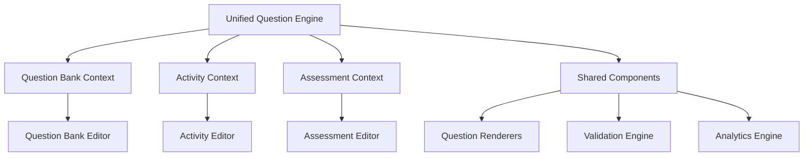

# Activities-Question Bank Integration Recommendations

## Executive Summary

This document provides comprehensive recommendations for resolving the architectural challenges identified in the activities and question bank systems. The proposed solutions focus on creating a unified architecture that eliminates code duplication, improves user experience, and establishes a maintainable foundation for future development.

## 1. Unified Architecture Approach

### 1.1 Recommended Architecture: Hybrid Model

**Core Principle**: Create a **unified question system** with **specialized activity contexts**.



### 1.2 Implementation Strategy

**Phase 1: Foundation (Weeks 1-4)**
- Create unified question model
- Implement shared component library
- Establish common validation engine

**Phase 2: Editor Unification (Weeks 5-8)**
- Merge editor implementations
- Create context-aware interfaces
- Implement seamless question bank integration

**Phase 3: Data Migration (Weeks 9-12)**
- Migrate existing activities to unified model
- Implement backward compatibility layer
- Update database schema

**Phase 4: Advanced Features (Weeks 13-16)**
- Add AI-powered question suggestions
- Implement real-time synchronization
- Deploy advanced analytics

## 2. Unified Question Model

### 2.1 Proposed Schema

```typescript
// Unified Question Interface
interface UnifiedQuestion {
  // Core identification
  id: string;
  title: string;
  type: QuestionType;
  
  // Content structure
  content: QuestionContent;
  metadata: QuestionMetadata;
  
  // Context information
  context: QuestionContext;
  
  // Academic integration
  academic: AcademicContext;
  
  // Lifecycle management
  lifecycle: QuestionLifecycle;
}

interface QuestionContext {
  source: 'question-bank' | 'activity' | 'assessment';
  sourceId: string;
  parentId?: string; // For question bank references
  isTemplate: boolean;
  allowModification: boolean;
}

interface AcademicContext {
  subjectId: string;
  courseId?: string;
  topicId?: string;
  gradeLevel?: number;
  bloomsLevel?: BloomsTaxonomyLevel;
  learningOutcomeIds: string[];
  difficulty: DifficultyLevel;
}

interface QuestionLifecycle {
  version: number;
  status: QuestionStatus;
  createdAt: Date;
  updatedAt: Date;
  createdBy: string;
  updatedBy?: string;
  syncedAt?: Date; // For question bank references
}
```

### 2.2 Benefits of Unified Model

**Consistency**: Single source of truth for question structure
**Flexibility**: Context-aware behavior without duplication
**Maintainability**: One model to update and maintain
**Extensibility**: Easy to add new question types and features

## 3. Editor Unification Strategy

### 3.1 Shared Editor Architecture

```typescript
// Unified Question Editor
interface UnifiedQuestionEditorProps {
  question: UnifiedQuestion;
  context: EditorContext;
  capabilities: EditorCapabilities;
  onChange: (question: UnifiedQuestion) => void;
  onValidate: (errors: ValidationError[]) => void;
}

interface EditorContext {
  mode: 'question-bank' | 'activity' | 'assessment';
  features: {
    allowBloomsEditing: boolean;
    allowDifficultyChange: boolean;
    showAdvancedOptions: boolean;
    enableAIGeneration: boolean;
    allowMediaUpload: boolean;
  };
  constraints: {
    maxOptions?: number;
    requiredFields: string[];
    validationRules: ValidationRule[];
  };
}
```

### 3.2 Context-Aware Components

**Question Bank Context:**
- Full editing capabilities
- Bloom's taxonomy integration
- Advanced metadata management
- Version control features

**Activity Context:**
- Streamlined interface
- AI generation integration
- Quick question creation
- Template-based workflows

**Assessment Context:**
- Rubric integration
- Point allocation
- Question weighting
- Performance analytics

### 3.3 Implementation Example

```typescript
// Unified Multiple Choice Editor
export const UnifiedMultipleChoiceEditor: React.FC<UnifiedQuestionEditorProps> = ({
  question,
  context,
  capabilities,
  onChange,
  onValidate
}) => {
  // Context-aware feature rendering
  const showBloomsTaxonomy = context.features.allowBloomsEditing;
  const showAIGeneration = context.features.enableAIGeneration;
  const showAdvancedOptions = context.features.showAdvancedOptions;
  
  return (
    <div className="unified-question-editor">
      {/* Core question editing - always visible */}
      <QuestionTextEditor 
        value={question.content.text}
        onChange={(text) => updateQuestionContent({ text })}
      />
      
      <OptionsEditor
        options={question.content.options}
        onChange={(options) => updateQuestionContent({ options })}
        maxOptions={context.constraints.maxOptions}
      />
      
      {/* Context-specific features */}
      {showBloomsTaxonomy && (
        <BloomsTaxonomySelector
          value={question.academic.bloomsLevel}
          onChange={(level) => updateAcademic({ bloomsLevel: level })}
        />
      )}
      
      {showAIGeneration && (
        <AIQuestionGenerator
          onGenerate={(generatedQuestion) => onChange(generatedQuestion)}
          context={question.academic}
        />
      )}
      
      {showAdvancedOptions && (
        <AdvancedOptionsPanel
          metadata={question.metadata}
          onChange={(metadata) => updateMetadata(metadata)}
        />
      )}
    </div>
  );
};
```

## 4. Seamless Question Bank Integration

### 4.1 Smart Question Selection

**Enhanced Selection Interface:**
```typescript
interface SmartQuestionSelector {
  // Intelligent filtering
  filters: {
    bloomsDistribution?: BloomsDistribution;
    difficultyProgression?: DifficultyProgression;
    topicCoverage?: TopicCoverage;
    usageHistory?: UsageHistory;
  };
  
  // AI-powered suggestions
  suggestions: {
    enableSmartSuggestions: boolean;
    learningObjectives: string[];
    studentPerformanceData?: PerformanceData;
  };
  
  // Bulk operations
  bulkActions: {
    selectByBloomsLevel: (level: BloomsTaxonomyLevel) => void;
    selectByDifficulty: (difficulty: DifficultyLevel) => void;
    selectByTopic: (topicId: string) => void;
    generateQuestionSet: (criteria: GenerationCriteria) => void;
  };
}
```

### 4.2 Real-Time Synchronization

**Bidirectional Sync System:**
```typescript
interface QuestionSyncService {
  // Sync question bank changes to activities
  syncBankToActivities(questionId: string): Promise<SyncResult>;
  
  // Sync activity modifications back to bank (if allowed)
  syncActivityToBank(activityQuestionId: string): Promise<SyncResult>;
  
  // Handle conflict resolution
  resolveConflicts(conflicts: SyncConflict[]): Promise<Resolution[]>;
  
  // Batch synchronization
  batchSync(operations: SyncOperation[]): Promise<BatchSyncResult>;
}

interface SyncResult {
  success: boolean;
  affectedActivities: string[];
  conflicts: SyncConflict[];
  warnings: string[];
}
```

### 4.3 Version Control Integration

**Question Versioning:**
- **Automatic Versioning**: Track changes to question bank questions
- **Impact Analysis**: Show which activities use specific question versions
- **Migration Tools**: Update activities when questions change
- **Rollback Capability**: Revert to previous question versions

## 5. Data Migration Strategy

### 5.1 Migration Phases

**Phase 1: Schema Preparation**
```sql
-- Create unified question table
CREATE TABLE unified_questions (
  id UUID PRIMARY KEY,
  title TEXT NOT NULL,
  type question_type NOT NULL,
  content JSONB NOT NULL,
  context JSONB NOT NULL,
  academic JSONB NOT NULL,
  lifecycle JSONB NOT NULL,
  created_at TIMESTAMP DEFAULT NOW(),
  updated_at TIMESTAMP DEFAULT NOW()
);

-- Migration tracking
CREATE TABLE question_migrations (
  id UUID PRIMARY KEY,
  source_table TEXT NOT NULL,
  source_id UUID NOT NULL,
  target_id UUID NOT NULL,
  migration_type TEXT NOT NULL,
  status TEXT NOT NULL,
  created_at TIMESTAMP DEFAULT NOW()
);
```

**Phase 2: Data Migration**
```typescript
interface MigrationService {
  // Migrate question bank questions
  migrateQuestionBankQuestions(): Promise<MigrationResult>;
  
  // Migrate activity questions
  migrateActivityQuestions(): Promise<MigrationResult>;
  
  // Create question bank references
  createQuestionBankReferences(): Promise<MigrationResult>;
  
  // Validate migration integrity
  validateMigration(): Promise<ValidationResult>;
}
```

### 5.2 Backward Compatibility

**Compatibility Layer:**
```typescript
// Legacy API compatibility
class LegacyQuestionAdapter {
  // Convert unified questions to legacy format
  toLegacyFormat(question: UnifiedQuestion): LegacyQuestion {
    return {
      id: question.id,
      type: this.convertQuestionType(question.type),
      text: question.content.text,
      options: question.content.options,
      // ... other legacy fields
    };
  }
  
  // Convert legacy questions to unified format
  fromLegacyFormat(legacyQuestion: LegacyQuestion): UnifiedQuestion {
    return {
      id: legacyQuestion.id,
      title: legacyQuestion.text,
      type: this.convertLegacyType(legacyQuestion.type),
      content: this.adaptContent(legacyQuestion),
      context: this.createDefaultContext(),
      academic: this.extractAcademicInfo(legacyQuestion),
      lifecycle: this.createLifecycleInfo(legacyQuestion),
    };
  }
}
```

## 6. Enhanced User Experience

### 6.1 Unified Workflow Design

**Teacher Experience:**
1. **Single Entry Point**: One interface for all question creation
2. **Context Switching**: Seamless transition between question bank and activity modes
3. **Smart Suggestions**: AI-powered question recommendations
4. **Bulk Operations**: Efficient management of multiple questions

**Student Experience:**
1. **Consistent Rendering**: Uniform question display across all contexts
2. **Progressive Enhancement**: Advanced features when available
3. **Accessibility**: WCAG 2.1 AA compliance across all question types
4. **Performance**: Optimized loading and interaction patterns

### 6.2 Advanced Features

**AI Integration:**
- **Question Generation**: Context-aware question creation
- **Difficulty Adjustment**: Automatic difficulty calibration
- **Content Suggestions**: Smart content recommendations
- **Performance Optimization**: AI-driven question selection

**Analytics Enhancement:**
- **Cross-Context Analytics**: Question performance across all uses
- **Learning Outcome Tracking**: Bloom's taxonomy progress
- **Predictive Analytics**: Student performance predictions
- **Usage Insights**: Question effectiveness metrics

## 7. Implementation Roadmap

### 7.1 Detailed Timeline

**Week 1-2: Foundation Setup**
- [ ] Create unified question model interfaces
- [ ] Implement shared validation engine
- [ ] Set up migration infrastructure
- [ ] Create compatibility layer

**Week 3-4: Core Components**
- [ ] Build unified question editor framework
- [ ] Implement context-aware rendering
- [ ] Create shared component library
- [ ] Set up testing infrastructure

**Week 5-6: Editor Migration**
- [ ] Migrate multiple choice editor
- [ ] Migrate true/false editor
- [ ] Migrate fill-in-the-blanks editor
- [ ] Implement editor context switching

**Week 7-8: Integration Features**
- [ ] Build smart question selector
- [ ] Implement real-time synchronization
- [ ] Create bulk operation tools
- [ ] Add AI-powered suggestions

**Week 9-10: Data Migration**
- [ ] Migrate question bank data
- [ ] Migrate activity data
- [ ] Create reference mappings
- [ ] Validate data integrity

**Week 11-12: Testing & Optimization**
- [ ] Comprehensive testing suite
- [ ] Performance optimization
- [ ] User acceptance testing
- [ ] Bug fixes and refinements

**Week 13-14: Advanced Features**
- [ ] Enhanced analytics
- [ ] Advanced AI features
- [ ] Workflow optimizations
- [ ] Documentation updates

**Week 15-16: Deployment & Monitoring**
- [ ] Production deployment
- [ ] Monitoring setup
- [ ] User training materials
- [ ] Post-deployment support

### 7.2 Success Metrics

**Technical Metrics:**
- **Code Reduction**: 50% reduction in duplicate code
- **Performance**: 30% faster question loading
- **Maintainability**: 70% reduction in bug fix time
- **Test Coverage**: 90% coverage across unified system

**User Experience Metrics:**
- **Creation Time**: 40% faster question creation
- **Error Rate**: 60% reduction in user errors
- **Feature Adoption**: 80% adoption of new features
- **User Satisfaction**: 4.5+ rating on usability surveys

## 8. Risk Mitigation

### 8.1 Technical Risks

**Data Migration Risks:**
- **Mitigation**: Comprehensive backup and rollback procedures
- **Testing**: Extensive migration testing in staging environment
- **Validation**: Automated data integrity checks

**Performance Risks:**
- **Mitigation**: Incremental deployment with performance monitoring
- **Optimization**: Caching strategies and database optimization
- **Fallback**: Legacy system availability during transition

### 8.2 User Adoption Risks

**Training Requirements:**
- **Mitigation**: Comprehensive training materials and workshops
- **Support**: Dedicated support team during transition
- **Feedback**: Regular user feedback collection and response

**Feature Parity:**
- **Mitigation**: Ensure all existing features are available in unified system
- **Enhancement**: Add new capabilities to encourage adoption
- **Communication**: Clear communication of benefits and improvements

## Conclusion

The proposed unified architecture addresses all major issues identified in the current activities and question bank systems. By implementing a hybrid model that maintains context-specific features while eliminating duplication, we can create a maintainable, scalable, and user-friendly system.

**Key Benefits:**
1. **50% Code Reduction**: Eliminate duplicate implementations
2. **Unified User Experience**: Consistent interface across all contexts
3. **Enhanced Capabilities**: AI-powered features and advanced analytics
4. **Future-Proof Architecture**: Scalable foundation for new features
5. **Improved Maintainability**: Single codebase for question management

The implementation roadmap provides a clear path forward with measurable milestones and success criteria. With proper execution, this unified system will significantly improve both developer productivity and user experience while establishing a solid foundation for future educational technology innovations.
