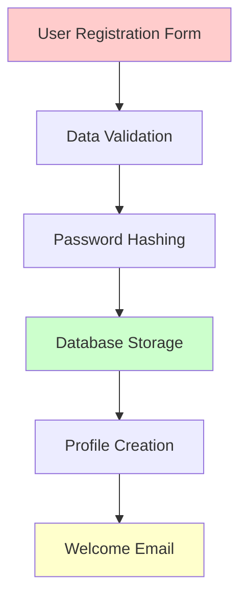
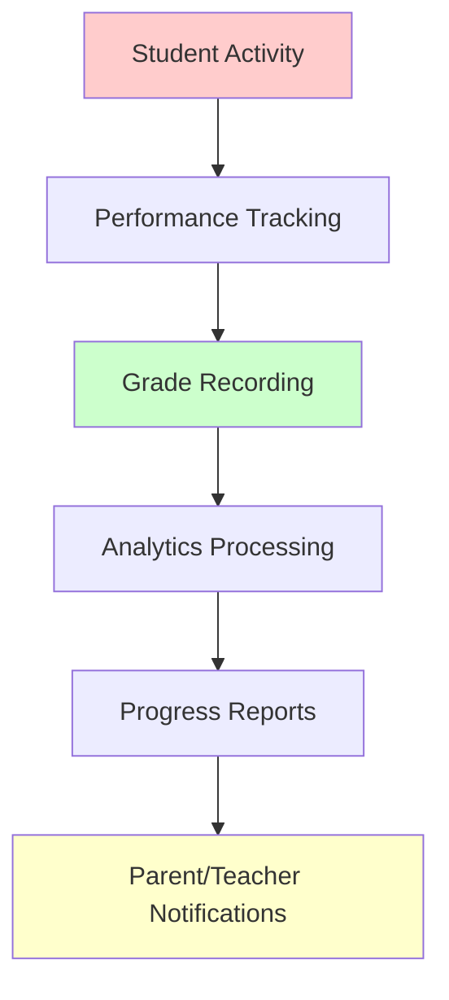
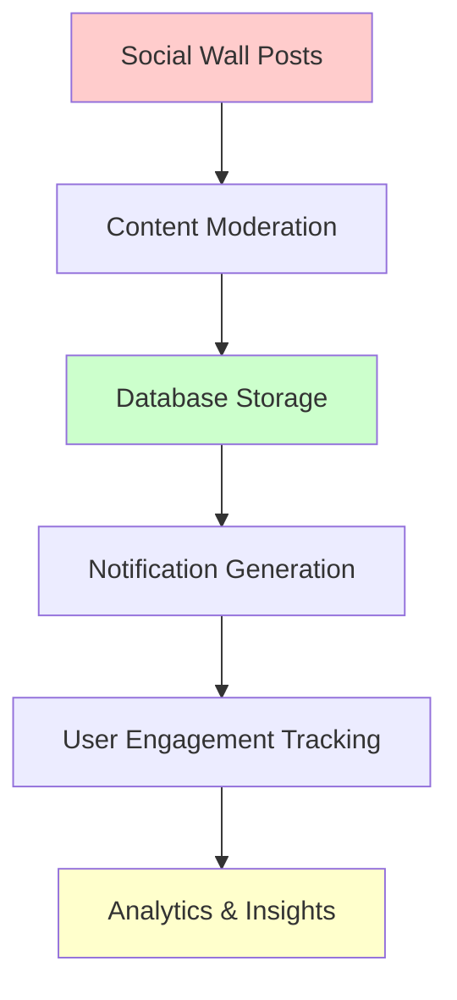

# Personal Data Mapping & Flow Analysis

## Overview

This document provides a comprehensive mapping of personal data collection, processing, storage, and sharing within the FabriiQ Learning Experience Platform. This mapping is essential for GDPR, PDPL, and FERPA compliance and serves as the foundation for privacy impact assessments and data subject rights implementation.

## Data Categories & Classification

### 🔍 Personal Data Categories

#### 1. Identity Data
**Data Elements:**
- Full name (first, middle, last)
- Email address
- Username
- Phone number
- Date of birth
- Profile photos/avatars

**Storage Location:**
```sql
-- Primary storage: users table
User {
  name: String
  email: String (unique)
  username: String (unique)
  phoneNumber: String
  dateOfBirth: DateTime
  profileData: Json (includes photos)
}
```

**Legal Basis:**
- **GDPR**: Contract performance (educational services)
- **PDPL**: Contract performance + Consent for optional data
- **FERPA**: Educational service provision

**Retention Period**: Account lifetime + 2 years post-deletion

#### 2. Educational Records (FERPA Protected)
**Data Elements:**
- Academic grades and assessments
- Attendance records
- Learning progress and analytics
- Assignment submissions
- Quiz and test results
- Behavioral observations
- Special educational needs

**Storage Location:**
```sql
-- Student academic data
StudentProfile {
  currentGrade: String
  academicHistory: Json
  attendanceRate: Float
  academicScore: Float
  participationRate: Float
  specialNeeds: Json
}

-- Assessment and activity data
Assessment, Activity, Grade tables
```

**Legal Basis:**
- **GDPR**: Legitimate interest (educational provision)
- **PDPL**: Contract performance
- **FERPA**: Educational service provision (no consent required)

**Retention Period**: 7 years post-graduation (educational requirements)

#### 3. Sensitive Personal Data
**Data Elements:**
- Special educational needs
- Health-related information
- Guardian/parental information
- Disciplinary records
- Counseling records

**Storage Location:**
```sql
StudentProfile {
  specialNeeds: Json        -- Encrypted sensitive data
  guardianInfo: Json        -- Parental contact information
  lastCounseling: DateTime  -- Counseling session tracking
}
```

**Legal Basis:**
- **GDPR**: Explicit consent required for special categories
- **PDPL**: Explicit consent + additional safeguards
- **FERPA**: Educational service provision with enhanced protection

**Retention Period**: Educational requirement period with enhanced security

#### 4. Communication Data
**Data Elements:**
- Social wall posts and comments
- Direct messages
- Notifications
- Email communications
- System announcements

**Storage Location:**
```sql
-- Social wall data
SocialPost, SocialComment, SocialReaction tables

-- Notification system
Notification table
```

**Legal Basis:**
- **GDPR**: Consent for social features, legitimate interest for educational communications
- **PDPL**: Consent for optional communications
- **FERPA**: Educational communication (directory information rules apply)

**Retention Period**: 2 years for social content, educational communication per institutional policy

### 📊 Data Processing Activities

#### Activity 1: User Registration & Authentication
**Purpose**: Account creation and access control
**Data Categories**: Identity data, authentication credentials
**Legal Basis**: Contract performance
**Automated Processing**: Yes (password hashing, session management)
**Third-Party Sharing**: None
**Retention**: Account lifetime + 2 years

**Current Implementation:**
```typescript
// Registration process
const registerUser = async (userData: CreateUserInput) => {
  // Hash password
  const hashedPassword = await hash(userData.password, 10);
  
  // Create user record
  const user = await prisma.user.create({
    data: {
      ...userData,
      password: hashedPassword,
      status: 'ACTIVE'
    }
  });
  
  // No consent tracking (GAP)
  // No data processing activity logging (GAP)
};
```

#### Activity 2: Educational Service Delivery
**Purpose**: Learning management, assessment, progress tracking
**Data Categories**: Educational records, performance data, attendance
**Legal Basis**: Contract performance / Legitimate interest
**Automated Processing**: Yes (grading, analytics, recommendations)
**Third-Party Sharing**: Limited (parent/guardian access)
**Retention**: Educational record requirements (7 years)

**Current Implementation:**
```typescript
// Grade recording
const recordGrade = async (gradeData: GradeInput) => {
  const grade = await prisma.grade.create({
    data: gradeData
  });
  
  // Update student performance metrics
  await updateStudentMetrics(gradeData.studentId);
  
  // No educational record disclosure logging (FERPA GAP)
  // No consent validation for analytics (GDPR GAP)
};
```

#### Activity 3: Analytics & Performance Monitoring
**Purpose**: Service improvement, learning analytics, performance insights
**Data Categories**: Usage data, performance metrics, behavioral patterns
**Legal Basis**: Legitimate interest / Consent (depending on scope)
**Automated Processing**: Yes (analytics algorithms, reporting)
**Third-Party Sharing**: Aggregated data only
**Retention**: 2 years detailed, indefinite aggregated

**Current Implementation:**
```typescript
// Analytics tracking
const trackEvent = async (eventData: AnalyticsEvent) => {
  await prisma.analyticsEvent.create({
    data: {
      event: eventData.type,
      userId: eventData.userId,
      data: eventData.metadata,
      timestamp: new Date()
    }
  });
  
  // No consent validation for analytics (GAP)
  // No data minimization controls (GAP)
};
```

## Data Flow Mapping

### 🔄 Data Collection Points

#### 1. User Registration Flow


**Data Collected:**
- Required: Name, email, username, password, user type
- Optional: Phone number, date of birth, profile information
- System Generated: User ID, creation timestamp, institution assignment

**Compliance Gaps:**
- ❌ No explicit consent capture
- ❌ No data processing purpose explanation
- ❌ No age verification for minors

#### 2. Educational Data Collection


**Data Collected:**
- Academic performance (grades, scores, completion rates)
- Behavioral data (participation, engagement, time spent)
- Assessment responses and submissions
- Learning path and progress tracking

**Compliance Gaps:**
- ❌ No educational record disclosure logging (FERPA)
- ❌ No consent for learning analytics (GDPR)
- ❌ No data minimization controls

#### 3. Social & Communication Data


**Data Collected:**
- Post content, comments, reactions
- User interactions and engagement metrics
- Communication preferences
- Moderation actions and reports

**Compliance Gaps:**
- ❌ No consent for social features
- ❌ No data retention policies for social content
- ❌ No user control over social data

### 🌐 Data Sharing & Third-Party Integrations

#### 1. Supabase Storage Integration
**Purpose**: File storage and content delivery
**Data Shared**: User-uploaded files, profile images, documents
**Legal Basis**: Contract performance
**Safeguards**: Access controls, encryption in transit
**Location**: Global CDN (potential PDPL compliance issue)

**Current Implementation:**
```typescript
// File upload to Supabase
const uploadFile = async (file: File, userId: string) => {
  const result = await supabase.storage
    .from('social-wall')
    .upload(`${userId}/${file.name}`, file);
    
  // No data localization controls (PDPL GAP)
  // No cross-border transfer documentation (GDPR GAP)
};
```

#### 2. Analytics Services
**Purpose**: Usage analytics and performance monitoring
**Data Shared**: Aggregated usage data, performance metrics
**Legal Basis**: Legitimate interest (needs consent validation)
**Safeguards**: Data anonymization, aggregation
**Location**: Various (needs documentation)

#### 3. Email Service Integration
**Purpose**: Transactional emails, notifications
**Data Shared**: Email addresses, names, notification content
**Legal Basis**: Contract performance
**Safeguards**: Encryption, access controls
**Location**: Global service (needs localization review)

### 📍 Data Storage Locations

#### Primary Database (PostgreSQL)
**Location**: Cloud provider (needs regional specification)
**Data Types**: All personal data categories
**Encryption**: In transit (HTTPS), at rest (needs implementation)
**Access Controls**: Role-based, authenticated access
**Backup**: Automated (needs retention policy)

#### File Storage (Supabase)
**Location**: Global CDN
**Data Types**: User uploads, profile images, documents
**Encryption**: In transit, at rest (provider managed)
**Access Controls**: Bucket-level permissions
**Backup**: Provider managed

#### Session Storage
**Location**: Application server memory/Redis
**Data Types**: Session tokens, temporary data
**Encryption**: JWT tokens
**Access Controls**: Session-based
**Retention**: 7 days maximum

## Data Subject Rights Impact

### 🔍 Right to Access
**Current Capability**: Basic user profile viewing
**Required Enhancement**: Comprehensive data export including:
- All personal data categories
- Processing activities and purposes
- Data sharing and third-party access
- Retention periods and deletion dates

**Implementation Gap**: Medium complexity

### ✏️ Right to Rectification
**Current Capability**: Profile editing, basic data correction
**Required Enhancement**: 
- Formal correction request process
- Data validation and approval workflows
- Audit trail for all corrections
- Notification of corrections to third parties

**Implementation Gap**: Low complexity

### 🗑️ Right to Erasure
**Current Capability**: Account deactivation
**Required Enhancement**:
- Complete data deletion across all systems
- Educational record protection (FERPA compliance)
- Third-party deletion requests
- Deletion audit trail and verification

**Implementation Gap**: High complexity (educational record conflicts)

### 📤 Right to Data Portability
**Current Capability**: Basic CSV export
**Required Enhancement**:
- Structured data formats (JSON-LD, XML)
- Machine-readable exports
- Cross-platform compatibility
- Secure transfer mechanisms

**Implementation Gap**: Medium complexity

## Compliance Recommendations

### 🚨 Immediate Actions (Week 1-2)
1. **Complete Data Inventory**: Document all data processing activities
2. **Legal Basis Review**: Validate legal basis for each processing purpose
3. **Consent Gap Analysis**: Identify where explicit consent is required
4. **Data Localization Assessment**: Review storage locations for PDPL compliance

### 🔧 Technical Implementation (Week 3-8)
1. **Consent Management System**: Implement comprehensive consent tracking
2. **Enhanced Audit Logging**: Add educational record disclosure tracking
3. **Data Classification**: Implement automated data categorization
4. **Retention Policies**: Automate data retention and deletion

### 📊 Monitoring & Compliance (Week 9-12)
1. **Compliance Dashboard**: Real-time compliance monitoring
2. **Data Flow Visualization**: Automated data flow mapping
3. **Privacy Impact Assessments**: Regular PIA processes
4. **Third-Party Audits**: Validate compliance implementation

## Data Protection Impact Assessment

### 🎯 High-Risk Processing Activities
1. **Automated Decision Making**: Grading algorithms, learning recommendations
2. **Special Category Data**: Health information, special educational needs
3. **Cross-Border Transfers**: International data sharing and storage
4. **Large-Scale Processing**: Institution-wide data processing

### 🛡️ Safeguards Required
- Explicit consent for high-risk processing
- Regular algorithm auditing and bias testing
- Enhanced security for sensitive data
- Data minimization and purpose limitation
- Regular compliance monitoring and reporting

---

**Data Mapping Version**: 1.0
**Last Updated**: 2025-06-30
**Next Review**: 2025-08-30
**Classification**: Confidential - Compliance Documentation
