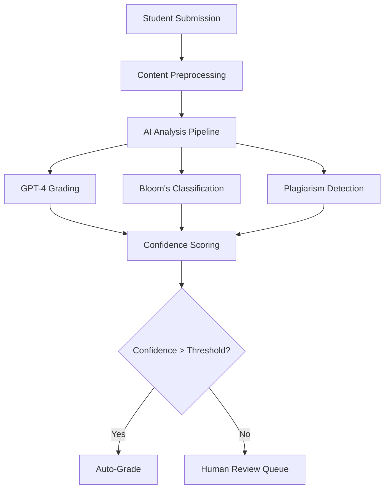

# 🔧 **TECHNICAL SPECIFICATIONS**

## 🎯 **SYSTEM ARCHITECTURE OVERVIEW**

The FabriiQ Activities System is built on a modern, scalable, cloud-native architecture designed for enterprise-grade educational technology deployment. The system leverages cutting-edge technologies to deliver AI-powered educational experiences with unmatched performance and reliability.

---

## 🏗️ **ARCHITECTURE COMPONENTS**

### **🌐 Frontend Architecture**

#### **Technology Stack**
- **Framework**: Next.js 14 with App Router
- **Language**: TypeScript 5.0+ (100% type-safe)
- **UI Library**: React 18 with Concurrent Features
- **Styling**: Tailwind CSS with Custom Design System
- **State Management**: Zustand + React Query
- **Forms**: React Hook Form with Zod validation
- **Charts**: Recharts + D3.js for advanced visualizations

#### **Component Architecture**
```typescript
// Unified Component Structure
src/
├── features/activties/
│   ├── components/
│   │   ├── UnifiedActivityCreator.tsx
│   │   ├── grading/HybridGradingWorkflow.tsx
│   │   ├── analytics/RealTimeAnalyticsDashboard.tsx
│   │   └── ui/StandardizedActivityConfig.tsx
│   ├── services/
│   │   ├── advanced-grading.service.ts
│   │   ├── ai-essay-grading.service.ts
│   │   ├── cognitive-analysis.service.ts
│   │   └── predictive-analytics.service.ts
│   └── utils/
│       ├── production-error-handler.ts
│       └── performance-optimizer.tsx
```

#### **Performance Optimizations**
- **Code Splitting**: Dynamic imports with lazy loading
- **Bundle Optimization**: Tree shaking and minification
- **Caching Strategy**: Multi-layer caching (Browser, CDN, Server)
- **Virtual Scrolling**: Efficient handling of large datasets
- **Image Optimization**: WebP support with lazy loading

### **🚀 Backend Architecture**

#### **API Layer**
- **Framework**: Next.js API Routes with Edge Runtime
- **Language**: TypeScript with strict type checking
- **Validation**: Zod schemas for request/response validation
- **Authentication**: NextAuth.js with JWT tokens
- **Rate Limiting**: Redis-based rate limiting
- **Middleware**: Custom middleware for logging, auth, validation

#### **Database Architecture**
```sql
-- Core Tables Structure
Activities (id, title, type, content, settings, created_at)
ActivityGrades (id, activity_id, student_id, score, feedback, ai_confidence)
AuditLog (id, user_id, action, entity_type, entity_id, timestamp)
Users (id, email, role, campus_id, created_at)
Classes (id, name, teacher_id, campus_id, settings)
```

#### **Database Technology**
- **Primary Database**: PostgreSQL 15+ with advanced indexing
- **ORM**: Prisma with type-safe database access
- **Connection Pooling**: PgBouncer for connection management
- **Backup Strategy**: Automated daily backups with point-in-time recovery
- **Performance**: Query optimization with explain analyze

### **🤖 AI/ML Infrastructure**

#### **AI Services Integration**
- **Primary AI**: OpenAI GPT-4 for essay grading and analysis
- **Embedding Models**: OpenAI text-embedding-ada-002
- **Vector Database**: Pinecone for semantic search
- **ML Pipeline**: Custom Python services for predictive analytics
- **Model Management**: MLflow for model versioning and deployment

#### **AI Processing Workflow**


---

## 📊 **DATA ARCHITECTURE**

### **🗄️ Database Schema Design**

#### **Core Entities**
```typescript
// Unified Type Definitions
interface UnifiedActivity {
  id: string;
  title: string;
  description: string;
  type: ActivityType;
  content: ActivityContent;
  settings: ActivitySettings;
  bloomsLevel: BloomsTaxonomyLevel;
  rubricId?: string;
  classId: string;
  createdById: string;
  createdAt: Date;
  updatedAt: Date;
}

interface ActivitySubmission {
  id: string;
  activityId: string;
  studentId: string;
  content: SubmissionContent;
  submittedAt: Date;
  status: SubmissionStatus;
  aiAnalysis?: AIAnalysisResult;
}

interface GradingResult {
  id: string;
  submissionId: string;
  score: number;
  maxScore: number;
  feedback: string;
  rubricScores: Record<string, number>;
  gradedBy: string;
  gradedAt: Date;
  aiConfidence?: number;
  bloomsAlignment: Record<BloomsTaxonomyLevel, number>;
}
```

#### **Indexing Strategy**
```sql
-- Performance Indexes
CREATE INDEX idx_activities_class_type ON activities(class_id, type);
CREATE INDEX idx_grades_student_activity ON activity_grades(student_id, activity_id);
CREATE INDEX idx_audit_user_timestamp ON audit_log(user_id, timestamp);
CREATE INDEX idx_submissions_status_date ON activity_submissions(status, submitted_at);

-- Composite Indexes for Analytics
CREATE INDEX idx_analytics_performance ON activity_grades(student_id, score, created_at);
CREATE INDEX idx_class_analytics ON activities(class_id, created_at, type);
```

### **📈 Analytics Data Pipeline**

#### **Real-Time Analytics Architecture**
```typescript
// Event-Driven Analytics System
interface AnalyticsEvent {
  eventType: string;
  userId: string;
  entityId: string;
  entityType: string;
  timestamp: Date;
  metadata: Record<string, any>;
}

// Analytics Processing Pipeline
EventCapture → EventValidation → RealTimeProcessing → DataAggregation → DashboardUpdate
```

#### **Data Aggregation Strategy**
- **Real-Time**: Redis for live metrics and counters
- **Historical**: PostgreSQL with time-series optimization
- **Reporting**: Pre-computed aggregations for fast reporting
- **Archival**: S3 for long-term data storage

---

## 🔒 **SECURITY ARCHITECTURE**

### **🛡️ Security Layers**

#### **Authentication & Authorization**
```typescript
// Role-Based Access Control
interface UserPermissions {
  role: 'STUDENT' | 'TEACHER' | 'ADMIN' | 'SUPER_ADMIN';
  permissions: {
    activities: CRUDPermissions;
    grades: CRUDPermissions;
    analytics: ViewPermissions;
    administration: AdminPermissions;
  };
  dataAccess: {
    campusId: string;
    classIds: string[];
    studentIds: string[];
  };
}
```

#### **Data Protection**
- **Encryption at Rest**: AES-256-GCM for database encryption
- **Encryption in Transit**: TLS 1.3 for all communications
- **Key Management**: AWS KMS for encryption key management
- **Data Masking**: PII masking in non-production environments
- **Audit Logging**: Comprehensive audit trail for all data access

#### **Security Monitoring**
```typescript
// Security Event Monitoring
interface SecurityEvent {
  eventType: 'LOGIN_ATTEMPT' | 'DATA_ACCESS' | 'PERMISSION_CHANGE';
  userId: string;
  ipAddress: string;
  userAgent: string;
  success: boolean;
  riskScore: number;
  timestamp: Date;
}
```

---

## ⚡ **PERFORMANCE SPECIFICATIONS**

### **📊 Performance Targets**

#### **Response Time Requirements**
- **API Endpoints**: < 100ms average response time
- **Page Load**: < 2 seconds initial load
- **Time to Interactive**: < 3 seconds
- **Database Queries**: < 50ms average query time
- **AI Processing**: < 5 seconds for essay grading

#### **Scalability Requirements**
- **Concurrent Users**: 10,000+ simultaneous users
- **Database Connections**: 1,000+ concurrent connections
- **API Throughput**: 10,000+ requests per second
- **Storage**: Unlimited scalability with cloud storage
- **Bandwidth**: Auto-scaling CDN for global distribution

### **🔧 Performance Optimization**

#### **Caching Strategy**
```typescript
// Multi-Layer Caching Architecture
interface CacheConfiguration {
  browser: {
    staticAssets: '1 year';
    apiResponses: '5 minutes';
  };
  cdn: {
    images: '1 month';
    scripts: '1 year';
    apiCache: '1 hour';
  };
  server: {
    redis: {
      sessions: '24 hours';
      analytics: '1 hour';
      queries: '15 minutes';
    };
    memory: {
      hotData: '5 minutes';
      userPreferences: '1 hour';
    };
  };
}
```

#### **Database Optimization**
- **Connection Pooling**: PgBouncer with 100 max connections
- **Query Optimization**: Automated query analysis and optimization
- **Read Replicas**: Multiple read replicas for analytics queries
- **Partitioning**: Table partitioning for large datasets
- **Indexing**: Automated index recommendations and creation

---

## 🌐 **DEPLOYMENT ARCHITECTURE**

### **☁️ Cloud Infrastructure**

#### **Production Environment**
```yaml
# Infrastructure as Code (Terraform)
production:
  compute:
    - type: "container"
      service: "AWS ECS Fargate"
      instances: "auto-scaling 2-20"
      cpu: "2 vCPU"
      memory: "4 GB"
  
  database:
    - type: "PostgreSQL"
      service: "AWS RDS"
      instance: "db.r6g.xlarge"
      storage: "1TB SSD"
    
  cache:
    - type: "Redis"
      service: "AWS ElastiCache"
      instance: "cache.r6g.large"
      memory: "16 GB"
  
  storage:
    - type: "Object Storage"
      service: "AWS S3"
      capacity: "unlimited"
      cdn: "CloudFront"
```

#### **Monitoring & Observability**
- **Application Monitoring**: Datadog for comprehensive monitoring
- **Error Tracking**: Sentry for error tracking and alerting
- **Log Management**: CloudWatch for centralized logging
- **Performance Monitoring**: New Relic for application performance
- **Uptime Monitoring**: Pingdom for availability monitoring

### **🔄 CI/CD Pipeline**

#### **Deployment Pipeline**
```yaml
# GitHub Actions Workflow
pipeline:
  stages:
    - code_quality:
        - typescript_check
        - eslint_analysis
        - prettier_formatting
        - security_scan
    
    - testing:
        - unit_tests
        - integration_tests
        - e2e_tests
        - performance_tests
    
    - build:
        - docker_build
        - security_scan
        - vulnerability_check
    
    - deploy:
        - staging_deployment
        - smoke_tests
        - production_deployment
        - health_checks
```

---

## 📱 **MOBILE & CROSS-PLATFORM**

### **📲 Mobile Architecture**

#### **Responsive Web Design**
- **Breakpoints**: Mobile-first responsive design
- **Touch Optimization**: Touch-friendly interface elements
- **Offline Support**: Service workers for offline functionality
- **PWA Features**: Progressive Web App capabilities
- **Performance**: Optimized for mobile networks

#### **Native App Considerations**
```typescript
// React Native Integration Points
interface MobileFeatures {
  offline: {
    dataSync: 'background sync when online';
    localStorage: 'encrypted local storage';
    caching: 'intelligent content caching';
  };
  
  notifications: {
    push: 'Firebase Cloud Messaging';
    local: 'scheduled local notifications';
    badges: 'app badge updates';
  };
  
  biometrics: {
    fingerprint: 'Touch ID / Fingerprint';
    face: 'Face ID / Face Recognition';
    pin: 'PIN-based authentication';
  };
}
```

---

## 🔍 **MONITORING & ANALYTICS**

### **📊 System Monitoring**

#### **Key Performance Indicators**
```typescript
// Monitoring Metrics
interface SystemMetrics {
  performance: {
    responseTime: number;
    throughput: number;
    errorRate: number;
    uptime: number;
  };
  
  business: {
    activeUsers: number;
    activitiesCreated: number;
    submissionsProcessed: number;
    gradingAccuracy: number;
  };
  
  technical: {
    cpuUsage: number;
    memoryUsage: number;
    diskUsage: number;
    networkLatency: number;
  };
}
```

#### **Alerting Strategy**
- **Critical Alerts**: Immediate notification for system failures
- **Warning Alerts**: Proactive alerts for performance degradation
- **Info Alerts**: Informational alerts for system events
- **Escalation**: Automatic escalation for unresolved critical issues

---

## 🔧 **DEVELOPMENT SPECIFICATIONS**

### **💻 Development Environment**

#### **Required Tools**
- **Node.js**: v18+ with npm/yarn package manager
- **TypeScript**: v5.0+ with strict type checking
- **Database**: PostgreSQL 15+ for local development
- **Redis**: v7+ for caching and sessions
- **Docker**: For containerized development environment

#### **Code Quality Standards**
```typescript
// TypeScript Configuration
{
  "compilerOptions": {
    "strict": true,
    "noImplicitAny": true,
    "noImplicitReturns": true,
    "noUnusedLocals": true,
    "noUnusedParameters": true
  }
}

// ESLint Configuration
{
  "extends": ["@typescript-eslint/recommended"],
  "rules": {
    "no-console": "error",
    "prefer-const": "error",
    "no-var": "error"
  }
}
```

### **🧪 Testing Strategy**

#### **Testing Pyramid**
- **Unit Tests**: 80% coverage with Jest and React Testing Library
- **Integration Tests**: API and component integration testing
- **E2E Tests**: Playwright for end-to-end user workflows
- **Performance Tests**: Load testing with Artillery
- **Security Tests**: OWASP ZAP for security testing

**🎯 This technical architecture ensures the FabriiQ Activities System delivers enterprise-grade performance, security, and scalability while maintaining developer productivity and code quality! 🎯**
