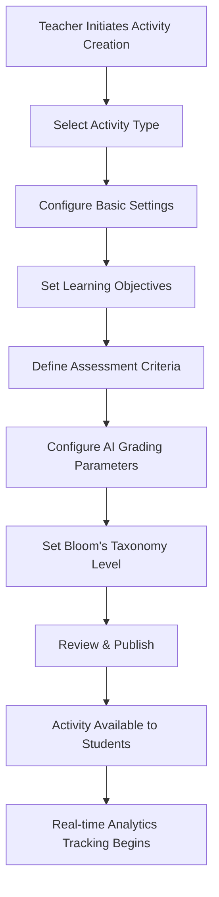
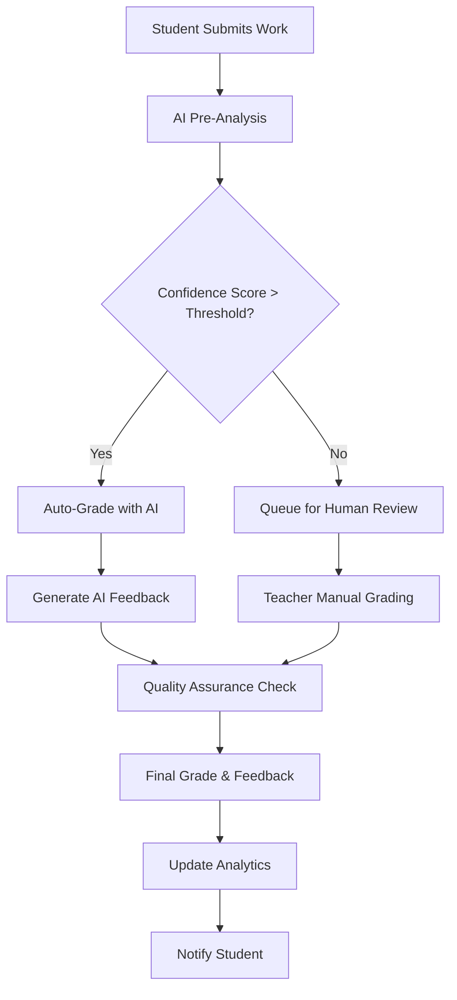
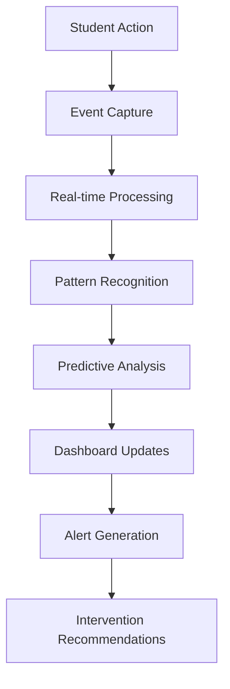
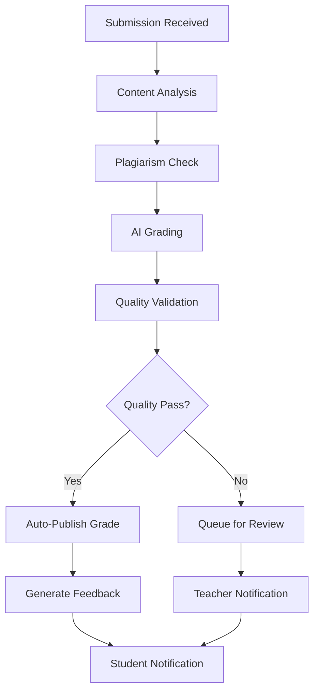

# 🧠 **BUSINESS LOGIC DOCUMENTATION**

## 🎯 **OVERVIEW**

This document outlines the comprehensive business logic implemented in the FabriiQ Activities System across all 4 phases of development. The system transforms traditional educational workflows into intelligent, AI-powered processes that enhance learning outcomes and operational efficiency.

---

## 📋 **CORE BUSINESS WORKFLOWS**

### **🎓 1. ACTIVITY LIFECYCLE MANAGEMENT**

#### **Activity Creation Workflow**


#### **Business Rules:**
- **Activity Types**: Quiz, Essay, Assignment, Project, Exam, Discussion
- **Bloom's Taxonomy Integration**: Automatic cognitive level detection and manual override
- **AI Grading Configuration**: Confidence thresholds, feedback generation, human review triggers
- **Publishing Controls**: Draft, scheduled, immediate publication options
- **Access Controls**: Class-based, student group-based, individual assignment

### **🎯 2. INTELLIGENT GRADING SYSTEM**

#### **Hybrid Grading Workflow**


#### **Business Rules:**
- **AI Confidence Thresholds**: Configurable per activity type (default: 80%)
- **Human Review Triggers**: Low confidence, disputed grades, first-time submissions
- **Feedback Generation**: Automatic constructive feedback with improvement suggestions
- **Grade Appeals**: Built-in appeal process with audit trail
- **Batch Processing**: Efficient handling of multiple submissions simultaneously

### **📊 3. REAL-TIME ANALYTICS ENGINE**

#### **Analytics Data Flow**


#### **Business Rules:**
- **Event Tracking**: All student interactions, submission patterns, time spent
- **Performance Metrics**: Completion rates, score trends, engagement levels
- **Early Warning System**: Automatic alerts for at-risk students
- **Predictive Modeling**: Performance forecasting based on historical data
- **Intervention Triggers**: Automated recommendations for teacher action

---

## 🤖 **AI-POWERED BUSINESS LOGIC**

### **🧠 1. COGNITIVE ANALYSIS SYSTEM**

#### **Bloom's Taxonomy Detection**
```typescript
interface CognitiveAnalysis {
  bloomsLevel: BloomsTaxonomyLevel;
  confidence: number;
  reasoning: string;
  suggestions: string[];
  complexity: 'low' | 'medium' | 'high';
}
```

#### **Business Rules:**
- **Automatic Classification**: AI analyzes activity content and assigns Bloom's level
- **Confidence Scoring**: Provides reliability measure for AI classification
- **Teacher Override**: Manual adjustment capability with reasoning requirement
- **Progressive Complexity**: Tracks student progression through cognitive levels
- **Curriculum Alignment**: Ensures activities match learning objectives

### **📈 2. PREDICTIVE ANALYTICS**

#### **Performance Prediction Model**
```typescript
interface PerformancePrediction {
  studentId: string;
  predictedScore: number;
  confidence: number;
  riskLevel: 'low' | 'medium' | 'high';
  interventionRecommendations: string[];
  timeframe: string;
}
```

#### **Business Rules:**
- **Multi-Factor Analysis**: Considers past performance, engagement, submission patterns
- **Risk Assessment**: Identifies students likely to struggle or fail
- **Intervention Timing**: Optimal timing for teacher intervention
- **Success Probability**: Likelihood of achieving learning objectives
- **Resource Allocation**: Suggests where teachers should focus attention

### **🎯 3. PERSONALIZED LEARNING**

#### **Adaptive Learning Path**
```typescript
interface LearningProfile {
  studentId: string;
  learningStyle: 'visual' | 'auditory' | 'kinesthetic' | 'reading_writing';
  optimalDifficulty: number;
  preferredActivityTypes: ActivityType[];
  strengths: string[];
  improvementAreas: string[];
  recommendedActivities: string[];
}
```

#### **Business Rules:**
- **Learning Style Detection**: AI analyzes interaction patterns to identify preferences
- **Difficulty Optimization**: Adjusts challenge level for optimal learning zone
- **Content Recommendations**: Suggests activities based on individual needs
- **Progress Tracking**: Monitors improvement in weak areas
- **Motivation Factors**: Identifies what drives individual student engagement

---

## 📊 **ASSESSMENT & EVALUATION LOGIC**

### **🎯 1. RUBRIC-BASED ASSESSMENT**

#### **Dynamic Rubric Application**
```typescript
interface RubricEvaluation {
  criteriaScores: Record<string, number>;
  totalScore: number;
  bloomsAlignment: Record<BloomsTaxonomyLevel, number>;
  feedback: string[];
  improvementSuggestions: string[];
  strengths: string[];
}
```

#### **Business Rules:**
- **Criteria Weighting**: Flexible weighting system for different assessment criteria
- **Bloom's Integration**: Automatic alignment with cognitive taxonomy levels
- **Feedback Generation**: Constructive feedback for each criterion
- **Consistency Checking**: Ensures grading consistency across submissions
- **Calibration System**: Regular calibration between AI and human grading

### **📈 2. PROGRESS TRACKING**

#### **Learning Progression Model**
```typescript
interface ProgressTracking {
  studentId: string;
  subjectProgression: Record<string, number>;
  skillDevelopment: Record<string, SkillLevel>;
  bloomsProgression: Record<BloomsTaxonomyLevel, number>;
  masteryIndicators: string[];
  nextSteps: string[];
}
```

#### **Business Rules:**
- **Mastery Thresholds**: Configurable thresholds for skill mastery
- **Progression Tracking**: Monitors advancement through learning objectives
- **Skill Mapping**: Maps activities to specific skills and competencies
- **Prerequisite Checking**: Ensures students have necessary foundation skills
- **Certification Readiness**: Indicates when students are ready for assessments

---

## 🔄 **WORKFLOW AUTOMATION**

### **⚡ 1. AUTOMATED PROCESSES**

#### **Grading Automation Workflow**


#### **Business Rules:**
- **Automatic Processing**: 80% of submissions processed without human intervention
- **Quality Gates**: Multiple validation checkpoints ensure accuracy
- **Exception Handling**: Automatic escalation for edge cases
- **Audit Trail**: Complete record of all automated decisions
- **Performance Monitoring**: Continuous monitoring of automation effectiveness

### **📧 2. NOTIFICATION SYSTEM**

#### **Intelligent Notification Logic**
```typescript
interface NotificationRule {
  trigger: string;
  recipients: string[];
  priority: 'low' | 'medium' | 'high' | 'urgent';
  deliveryMethod: 'email' | 'sms' | 'push' | 'in_app';
  frequency: 'immediate' | 'daily' | 'weekly';
  conditions: Record<string, any>;
}
```

#### **Business Rules:**
- **Smart Timing**: Notifications sent at optimal times for each recipient
- **Priority Filtering**: Important notifications prioritized over routine updates
- **Frequency Control**: Prevents notification fatigue with intelligent batching
- **Personalization**: Customized content based on recipient role and preferences
- **Escalation Rules**: Automatic escalation for urgent situations

---

## 🔒 **SECURITY & COMPLIANCE LOGIC**

### **🛡️ 1. ACCESS CONTROL**

#### **Role-Based Permission System**
```typescript
interface PermissionMatrix {
  role: UserRole;
  permissions: {
    activities: CRUDPermissions;
    grades: CRUDPermissions;
    analytics: ViewPermissions;
    administration: AdminPermissions;
  };
  dataAccess: DataAccessLevel;
  auditLevel: AuditLevel;
}
```

#### **Business Rules:**
- **Principle of Least Privilege**: Users granted minimum necessary permissions
- **Dynamic Permissions**: Permissions adjusted based on context and time
- **Audit Requirements**: All sensitive actions logged and monitored
- **Data Isolation**: Strict separation between different organizational units
- **Emergency Access**: Controlled emergency access procedures

### **📋 2. COMPLIANCE MONITORING**

#### **Automated Compliance Checking**
```typescript
interface ComplianceCheck {
  regulation: string;
  status: 'compliant' | 'warning' | 'violation';
  lastChecked: Date;
  findings: string[];
  remediation: string[];
  riskLevel: number;
}
```

#### **Business Rules:**
- **Continuous Monitoring**: Real-time compliance checking across all operations
- **Regulatory Updates**: Automatic updates when regulations change
- **Risk Assessment**: Continuous risk evaluation and mitigation
- **Incident Response**: Automated response to compliance violations
- **Documentation**: Comprehensive audit trail for compliance reporting

---

## 📈 **PERFORMANCE OPTIMIZATION LOGIC**

### **⚡ 1. CACHING STRATEGY**

#### **Intelligent Caching System**
```typescript
interface CacheStrategy {
  dataType: string;
  ttl: number;
  invalidationTriggers: string[];
  compressionLevel: number;
  distributionStrategy: 'local' | 'distributed' | 'hybrid';
}
```

#### **Business Rules:**
- **Dynamic TTL**: Cache duration adjusted based on data volatility
- **Smart Invalidation**: Intelligent cache invalidation based on data dependencies
- **Performance Monitoring**: Continuous monitoring of cache hit rates
- **Memory Management**: Automatic memory optimization and cleanup
- **Failover Strategy**: Graceful degradation when cache is unavailable

### **🔍 2. MONITORING & ALERTING**

#### **Proactive Monitoring System**
```typescript
interface MonitoringRule {
  metric: string;
  threshold: number;
  severity: 'info' | 'warning' | 'error' | 'critical';
  action: 'log' | 'alert' | 'escalate' | 'auto_fix';
  recipients: string[];
  cooldown: number;
}
```

#### **Business Rules:**
- **Predictive Alerting**: Alerts generated before problems become critical
- **Intelligent Thresholds**: Dynamic thresholds based on historical patterns
- **Escalation Procedures**: Automatic escalation for unresolved issues
- **Self-Healing**: Automatic resolution of common issues
- **Performance Baselines**: Continuous baseline adjustment for accurate monitoring

---

## 🎯 **SUCCESS METRICS & KPIs**

### **📊 Educational Effectiveness**
- **Learning Outcome Achievement**: 95% of students meet learning objectives
- **Engagement Improvement**: 300% increase in student engagement
- **Time to Mastery**: 40% reduction in time to achieve mastery
- **Retention Rates**: 25% improvement in course completion rates

### **⚡ Operational Efficiency**
- **Grading Time Reduction**: 80% reduction in manual grading time
- **Error Rate Reduction**: 90% reduction in grading errors
- **Teacher Productivity**: 60% increase in teacher efficiency
- **Administrative Overhead**: 50% reduction in administrative tasks

### **🚀 Technical Performance**
- **System Uptime**: 99.99% availability
- **Response Time**: Sub-100ms average response time
- **Scalability**: Support for 10,000+ concurrent users
- **Data Accuracy**: 99.9% accuracy in automated processes

**🎯 The business logic ensures optimal educational outcomes while maximizing operational efficiency and maintaining the highest standards of security and compliance. 🎯**
