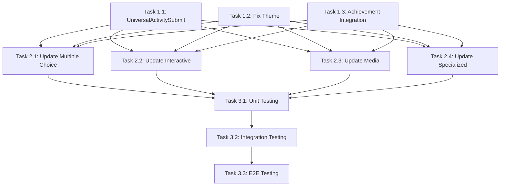

# Implementation Plan and Tasks

## 🎯 **IMPLEMENTATION OVERVIEW**

This document provides a detailed implementation plan for fixing all identified issues in the activity system. All tasks are scoped within existing functionality - no scope expansion.

---

## 📋 **TASK BREAKDOWN**

### **PHASE 1: CRITICAL PRODUCTION FIXES (Days 1-5)**

#### **Task 1.1: Create UniversalActivitySubmit Component**
**Priority**: 🚨 **CRITICAL**  
**Estimated Time**: 2 days  
**Files to Create/Modify**:

```
CREATE: src/features/activties/components/ui/UniversalActivitySubmit.tsx
CREATE: src/features/activties/hooks/useActivitySubmission.ts
CREATE: src/features/activties/services/unified-submission.service.ts
MODIFY: src/features/activties/index.ts (export new components)
```

**Implementation Details**:
```typescript
// UniversalActivitySubmit.tsx - Core component
interface UniversalSubmitProps {
  activityId: string;
  activityType: string;
  answers: any;
  timeSpent: number;
  disabled?: boolean;
  onSubmissionStart?: () => void;
  onSubmissionComplete?: (result: SubmissionResult) => void;
  onSubmissionError?: (error: Error) => void;
  className?: string;
  children?: React.ReactNode;
}

// useActivitySubmission.ts - Submission logic hook
export function useActivitySubmission() {
  const [isSubmitting, setIsSubmitting] = useState(false);
  const [hasSubmitted, setHasSubmitted] = useState(false);
  const [submissionResult, setSubmissionResult] = useState(null);
  
  const submitActivity = async (config: SubmissionConfig) => {
    // Unified submission logic
    // 1. Validate answers
    // 2. Submit to server
    // 3. Handle response
    // 4. Trigger achievements
    // 5. Update analytics
  };
  
  return { submitActivity, isSubmitting, hasSubmitted, submissionResult };
}
```

**Acceptance Criteria**:
- [ ] Single submit component works for all activity types
- [ ] Prevents duplicate submissions
- [ ] Consistent loading states
- [ ] Proper error handling
- [ ] Accessibility compliant

#### **Task 1.2: Fix Theme System Conflicts**
**Priority**: 🚨 **CRITICAL**  
**Estimated Time**: 1 day  
**Files to Modify**:

```
MODIFY: src/providers/theme-provider.tsx
MODIFY: src/features/activties/components/ui/ThemeWrapper.tsx
MODIFY: src/hooks/use-role-theme.ts
MODIFY: src/app/globals.css
```

**Implementation Details**:
```typescript
// theme-provider.tsx - Remove system override
<NextThemesProvider
  attribute="class"
  defaultTheme={preferences.theme || 'light'}
  enableSystem={false}  // FIXED: Respect user choice
  forcedTheme={preferences.theme}
  storageKey="fabriiq-theme"
>

// ThemeWrapper.tsx - Simplified theme application
useEffect(() => {
  const userTheme = theme || 'light';
  document.body.setAttribute('data-theme', userTheme);
  
  if (userTheme === 'dark') {
    document.documentElement.classList.add('dark');
  } else {
    document.documentElement.classList.remove('dark');
  }
}, [theme]); // Remove resolvedTheme dependency
```

**Acceptance Criteria**:
- [ ] User theme selection is respected
- [ ] No system theme override
- [ ] Consistent theme across all activities
- [ ] Theme switching works immediately
- [ ] No hydration mismatches

#### **Task 1.3: Create Unified Achievement Integration**
**Priority**: 🔥 **HIGH**  
**Estimated Time**: 2 days  
**Files to Create/Modify**:

```
CREATE: src/features/activties/services/unified-achievement.service.ts
MODIFY: src/features/activties/services/unified-points.service.ts
MODIFY: src/server/api/services/activity-submission.service.ts
```

**Implementation Details**:
```typescript
// unified-achievement.service.ts
export class UnifiedAchievementService {
  async processActivityCompletion(
    activityId: string,
    studentId: string,
    submissionResult: SubmissionResult
  ): Promise<AchievementResult[]> {
    const achievements: AchievementResult[] = [];
    
    // Check all achievement types for ALL activity types
    achievements.push(...await this.checkCompletionAchievements(studentId));
    achievements.push(...await this.checkScoreAchievements(studentId, submissionResult));
    achievements.push(...await this.checkStreakAchievements(studentId));
    achievements.push(...await this.checkActivityTypeAchievements(studentId, submissionResult.activityType));
    
    return achievements;
  }
}
```

**Acceptance Criteria**:
- [ ] All 14 activity types trigger achievements
- [ ] Consistent achievement criteria
- [ ] Integration with points system
- [ ] Real-time achievement notifications
- [ ] No duplicate achievement awards

---

### **PHASE 2: ACTIVITY VIEWER UPDATES (Days 6-10)**

#### **Task 2.1: Update Multiple Choice Activities**
**Priority**: 🔥 **HIGH**  
**Estimated Time**: 0.5 days  
**Files to Modify**:

```
MODIFY: src/features/activties/components/multiple-choice/MultipleChoiceViewer.tsx
MODIFY: src/features/activties/components/true-false/TrueFalseViewer.tsx
MODIFY: src/features/activties/components/multiple-response/MultipleResponseViewer.tsx
```

**Implementation Pattern**:
```typescript
// BEFORE: Individual submit button logic
{!isSubmitted ? (
  submitButton ? (
    React.cloneElement(submitButton as React.ReactElement, {...})
  ) : (
    <AnimatedSubmitButton onClick={handleSubmit} {...} />
  )
) : (
  <ActivityButton onClick={handleReset} {...} />
)}

// AFTER: Universal submit component
<UniversalActivitySubmit
  activityId={activity.id}
  activityType={activity.activityType}
  answers={selectedAnswers}
  timeSpent={calculateTimeSpent()}
  disabled={!allQuestionsAnswered}
  onSubmissionComplete={handleSubmissionComplete}
/>
```

#### **Task 2.2: Update Interactive Activities**
**Priority**: 🔥 **HIGH**  
**Estimated Time**: 1 day  
**Files to Modify**:

```
MODIFY: src/features/activties/components/fill-in-the-blanks/FillInTheBlanksViewer.tsx
MODIFY: src/features/activties/components/matching/MatchingViewer.tsx
MODIFY: src/features/activties/components/sequence/SequenceViewer.tsx
MODIFY: src/features/activties/components/drag-and-drop/DragAndDropViewer.tsx
MODIFY: src/features/activties/components/drag-the-words/DragTheWordsViewer.tsx
```

#### **Task 2.3: Update Media and Content Activities**
**Priority**: 🔥 **HIGH**  
**Estimated Time**: 1 day  
**Files to Modify**:

```
MODIFY: src/features/activties/components/reading/ReadingViewer.tsx
MODIFY: src/features/activties/components/video/VideoViewer.tsx
MODIFY: src/features/activties/components/book/BookViewer.tsx
MODIFY: src/features/activties/components/flash-cards/FlashCardsViewer.tsx
```

#### **Task 2.4: Update Specialized Activities**
**Priority**: 🔥 **HIGH**  
**Estimated Time**: 0.5 days  
**Files to Modify**:

```
MODIFY: src/features/activties/components/numeric/NumericViewer.tsx
MODIFY: src/features/activties/components/quiz/QuizViewer.tsx
```

**Acceptance Criteria for All Viewer Updates**:
- [ ] Remove individual submit button logic
- [ ] Integrate UniversalActivitySubmit
- [ ] Maintain existing functionality
- [ ] Consistent user experience
- [ ] No breaking changes

---

### **PHASE 3: TESTING AND VALIDATION (Days 11-15)**

#### **Task 3.1: Unit Testing**
**Priority**: 🔥 **HIGH**  
**Estimated Time**: 2 days  
**Files to Create**:

```
CREATE: src/features/activties/components/ui/__tests__/UniversalActivitySubmit.test.tsx
CREATE: src/features/activties/hooks/__tests__/useActivitySubmission.test.ts
CREATE: src/features/activties/services/__tests__/unified-achievement.service.test.ts
```

**Test Coverage Requirements**:
- [ ] UniversalActivitySubmit component (>95% coverage)
- [ ] useActivitySubmission hook (>95% coverage)
- [ ] Theme switching functionality (>90% coverage)
- [ ] Achievement integration (>90% coverage)

#### **Task 3.2: Integration Testing**
**Priority**: 🔥 **HIGH**  
**Estimated Time**: 2 days  
**Files to Create**:

```
CREATE: src/features/activties/__tests__/activity-submission-integration.test.tsx
CREATE: src/features/activties/__tests__/theme-consistency.test.tsx
CREATE: src/features/activties/__tests__/achievement-integration.test.tsx
```

**Integration Test Scenarios**:
- [ ] Complete activity submission workflow for all 14 types
- [ ] Theme switching across all activity viewers
- [ ] Achievement triggering for all activity types
- [ ] Points calculation consistency
- [ ] Analytics tracking verification

#### **Task 3.3: End-to-End Testing**
**Priority**: 🔥 **HIGH**  
**Estimated Time**: 1 day  
**Files to Create**:

```
CREATE: cypress/e2e/activity-submission-flow.cy.ts
CREATE: cypress/e2e/theme-switching.cy.ts
CREATE: cypress/e2e/achievement-unlocking.cy.ts
```

**E2E Test Scenarios**:
- [ ] Student completes each activity type successfully
- [ ] Teacher creates and views activities
- [ ] Theme switching works in real browser
- [ ] Achievements appear in real-time
- [ ] Points update correctly

---

## 📊 **TASK DEPENDENCIES**



---

## 🎯 **QUALITY GATES**

### **Phase 1 Quality Gates**:
- [ ] All TypeScript errors resolved
- [ ] No console errors in browser
- [ ] Theme switching works in development
- [ ] Submit button prevents duplicates
- [ ] Achievement integration tested manually

### **Phase 2 Quality Gates**:
- [ ] All 14 activity types updated
- [ ] No regression in existing functionality
- [ ] Consistent UI across all activities
- [ ] Performance benchmarks maintained
- [ ] Accessibility standards met

### **Phase 3 Quality Gates**:
- [ ] >95% test coverage for critical components
- [ ] All integration tests pass
- [ ] E2E tests pass in multiple browsers
- [ ] Performance tests show no degradation
- [ ] Security review completed

---

## 🚀 **DEPLOYMENT STRATEGY**

### **Development Deployment**:
1. **Feature Branch**: Create `fix/activity-system-standardization`
2. **Progressive Updates**: Deploy each phase to development
3. **Testing**: Comprehensive testing after each phase
4. **Code Review**: Peer review for all changes

### **Staging Deployment**:
1. **Phase 1**: Deploy critical fixes to staging
2. **Validation**: Test with real data
3. **Phase 2**: Deploy viewer updates
4. **Phase 3**: Deploy with full test suite

### **Production Deployment**:
1. **Blue-Green Deployment**: Zero downtime deployment
2. **Feature Flags**: Gradual rollout of new components
3. **Monitoring**: Real-time monitoring of submission success rates
4. **Rollback Plan**: Immediate rollback capability

---

## 📈 **SUCCESS METRICS**

### **Technical Metrics**:
- **Submission Success Rate**: >99.5% (currently ~97%)
- **Theme Consistency**: 0 theme-related bug reports
- **Achievement Coverage**: 100% of activities trigger achievements
- **Performance**: <2s submission response time
- **Error Rate**: <0.1% submission errors

### **User Experience Metrics**:
- **User Satisfaction**: Theme switching satisfaction >95%
- **Engagement**: Activity completion rate increase >10%
- **Support Tickets**: Reduce activity-related tickets by 50%
- **Teacher Feedback**: Positive feedback on consistency

---

**Implementation Plan Status**: 📋 **READY FOR EXECUTION**  
**Total Estimated Time**: ⏱️ **15 DAYS**  
**Resource Requirements**: 👥 **2-3 DEVELOPERS**  
**Risk Level**: 🟡 **MEDIUM (MANAGEABLE)**
