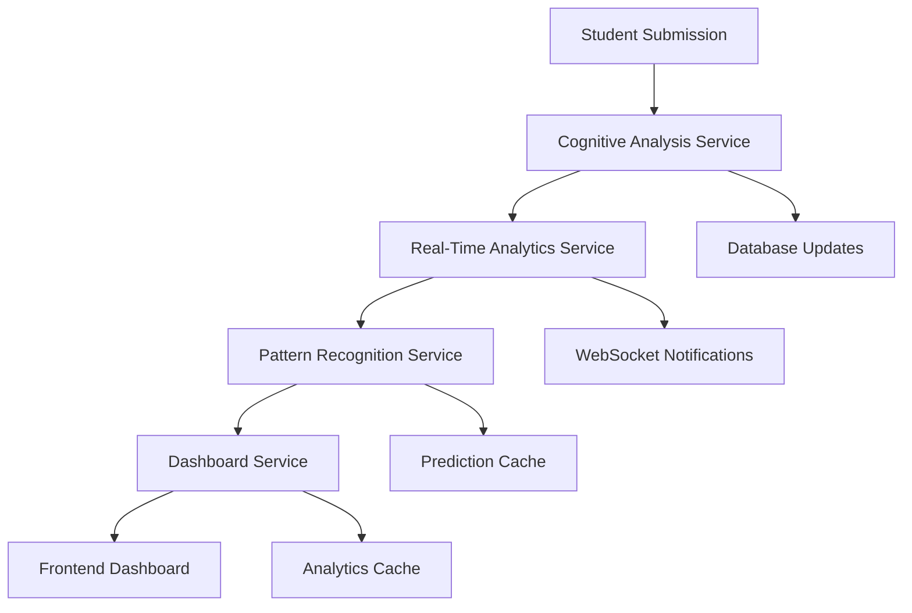

# Phase 3: Advanced Analytics Integration - Complete Guide

## Overview

Phase 3 introduces a comprehensive advanced analytics system that provides AI-powered cognitive analysis, real-time Bloom's taxonomy tracking, learning pattern recognition, and unified dashboard analytics for educational insights.

## 🚀 Key Features Implemented

### 1. AI-Powered Cognitive Analysis
- **Automatic Bloom's Level Detection**: AI analyzes student work to identify demonstrated cognitive levels
- **Confidence Scoring**: Provides confidence metrics for AI assessments
- **Cognitive Progression Tracking**: Monitors student development over time
- **Skills Assessment**: Evaluates critical thinking, problem-solving, creativity, and analysis skills
- **Class-Level Insights**: Generates comprehensive cognitive insights for entire classes

### 2. Real-Time Bloom's Analytics
- **Live Progression Tracking**: Real-time monitoring of student cognitive development
- **Achievement Verification**: Validates level achievements through consistency checks
- **Milestone Detection**: Identifies and celebrates cognitive milestones
- **WebSocket Integration**: Provides live updates to dashboards
- **Performance Correlation**: Links Bloom's levels with academic performance

### 3. Advanced Learning Pattern Recognition
- **Learning Style Detection**: Identifies visual, auditory, kinesthetic, and reading/writing preferences
- **Cognitive Preferences**: Analyzes processing speed, complexity preferences, and feedback sensitivity
- **Performance Prediction**: Predicts student performance on upcoming activities
- **Early Warning System**: Detects at-risk students before problems escalate
- **Adaptive Recommendations**: Provides personalized learning suggestions

### 4. Unified Analytics Dashboard
- **Comprehensive Overview**: Single dashboard for all analytics data
- **Student Deep Dive**: Detailed individual student analytics
- **Class Analytics**: Complete class performance and progression insights
- **Predictive Insights**: Future performance predictions and risk assessments
- **Real-Time Updates**: Live data updates and notifications
- **Export Capabilities**: Data export in CSV, JSON, and PDF formats

## 🏗️ Architecture

### Service Layer Structure

```
src/server/api/services/
├── cognitive-analysis.service.ts           # AI-powered cognitive analysis
├── realtime-blooms-analytics.service.ts    # Real-time Bloom's tracking
├── learning-pattern-recognition.service.ts # Pattern recognition and prediction
├── unified-analytics-dashboard.service.ts  # Dashboard aggregation
└── __tests__/
    └── analytics-integration.test.ts       # Comprehensive integration tests
```

### Data Flow



## 📊 Core Services

### Cognitive Analysis Service

**Purpose**: AI-powered analysis of student work to detect cognitive levels and skills.

**Key Methods**:
```typescript
// Analyze cognitive level from student work
async analyzeCognitiveLevel(
  studentWork: string,
  activityType: string,
  expectedLevel?: BloomsTaxonomyLevel
): Promise<CognitiveAnalysisResult>

// Track cognitive progression over time
async trackCognitiveProgression(
  studentId: string,
  classId?: string,
  timeframe?: { start: Date; end: Date }
): Promise<CognitiveProgression>

// Generate class-level cognitive insights
async generateClassCognitiveInsights(
  classId: string,
  timeframe?: { start: Date; end: Date }
): Promise<ClassCognitiveInsights>
```

**Features**:
- GPT-4 integration for accurate cognitive assessment
- Multi-dimensional skill evaluation
- Confidence scoring and validation
- Evidence-based reasoning
- Adaptive recommendations

### Real-Time Bloom's Analytics Service

**Purpose**: Real-time tracking and verification of Bloom's taxonomy progression.

**Key Methods**:
```typescript
// Process new activity submission
async processActivitySubmission(
  submissionId: string,
  studentId: string,
  classId: string,
  activityId: string,
  studentWork: string,
  activityType: string
): Promise<BloomsProgressionEvent | null>

// Get real-time student metrics
async getStudentRealTimeMetrics(
  studentId: string
): Promise<RealTimeBloomsMetrics>

// Verify level achievement through consistency
async verifyLevelAchievement(
  studentId: string,
  level: BloomsTaxonomyLevel,
  requiredConsistency: number = 3
): Promise<boolean>
```

**Features**:
- WebSocket-based real-time updates
- Achievement verification system
- Milestone tracking and celebration
- Regression detection and alerts
- Performance correlation analysis

### Learning Pattern Recognition Service

**Purpose**: Advanced pattern recognition for personalized learning insights.

**Key Methods**:
```typescript
// Analyze comprehensive learning patterns
async analyzeStudentLearningPatterns(
  studentId: string,
  timeframe?: { start: Date; end: Date }
): Promise<StudentLearningProfile>

// Predict performance on upcoming activities
async predictPerformance(
  studentId: string,
  activityType: string,
  bloomsLevel: BloomsTaxonomyLevel,
  difficulty: number
): Promise<PerformancePrediction>

// Detect early warning indicators
async detectEarlyWarnings(
  studentId: string,
  classId?: string
): Promise<EarlyWarning[]>
```

**Features**:
- Multi-dimensional learning style analysis
- Performance prediction algorithms
- Early warning detection system
- Adaptive content recommendations
- Learning path optimization

### Unified Analytics Dashboard Service

**Purpose**: Comprehensive dashboard aggregating all analytics data.

**Key Methods**:
```typescript
// Get dashboard overview
async getDashboardOverview(
  teacherId: string,
  classId?: string,
  timeframe?: { start: Date; end: Date }
): Promise<DashboardOverview>

// Get detailed student analytics
async getStudentAnalytics(
  studentId: string,
  timeframe?: { start: Date; end: Date }
): Promise<StudentAnalytics>

// Get comprehensive class analytics
async getClassAnalytics(
  classId: string,
  timeframe?: { start: Date; end: Date }
): Promise<ClassAnalytics>
```

**Features**:
- Unified data aggregation
- Real-time updates and notifications
- Comprehensive reporting
- Export capabilities
- Predictive insights integration

## 🔧 Implementation Guide

### 1. Service Initialization

```typescript
import { PrismaClient } from '@prisma/client';
import { 
  CognitiveAnalysisService,
  RealTimeBloomsAnalyticsService,
  LearningPatternRecognitionService,
  UnifiedAnalyticsDashboardService 
} from '@/server/api/services';

const prisma = new PrismaClient();

// Initialize services
const cognitiveService = new CognitiveAnalysisService(prisma);
const realTimeService = new RealTimeBloomsAnalyticsService(prisma);
const patternService = new LearningPatternRecognitionService(prisma);
const dashboardService = new UnifiedAnalyticsDashboardService(prisma);
```

### 2. Processing Student Submissions

```typescript
// When a student submits work
async function processSubmission(submissionData: {
  submissionId: string;
  studentId: string;
  classId: string;
  activityId: string;
  studentWork: string;
  activityType: string;
}) {
  // 1. Process through real-time analytics
  const progressionEvent = await realTimeService.processActivitySubmission(
    submissionData.submissionId,
    submissionData.studentId,
    submissionData.classId,
    submissionData.activityId,
    submissionData.studentWork,
    submissionData.activityType
  );

  // 2. Update learning patterns
  const profile = await patternService.analyzeStudentLearningPatterns(
    submissionData.studentId
  );

  // 3. Check for early warnings
  const warnings = await patternService.detectEarlyWarnings(
    submissionData.studentId,
    submissionData.classId
  );

  // 4. Notify dashboard of updates
  if (progressionEvent) {
    // Emit real-time update to connected clients
    realTimeService.emit('blooms_progression', progressionEvent);
  }

  return { progressionEvent, profile, warnings };
}
```

### 3. Dashboard Integration

```typescript
// Get comprehensive dashboard data
async function getDashboardData(teacherId: string, classId: string) {
  const [overview, classAnalytics, predictions] = await Promise.all([
    dashboardService.getDashboardOverview(teacherId, classId),
    dashboardService.getClassAnalytics(classId),
    dashboardService.getPredictiveInsights(classId)
  ]);

  return {
    overview,
    classAnalytics,
    predictions
  };
}
```

### 4. Real-Time Updates

```typescript
// WebSocket integration for real-time updates
import { WebSocket } from 'ws';

function setupRealTimeUpdates(classId: string, websocket: WebSocket) {
  // Subscribe to real-time updates
  realTimeService.subscribeToUpdates(classId, websocket);

  // Handle progression events
  realTimeService.on('blooms_progression', (event) => {
    if (event.classId === classId) {
      websocket.send(JSON.stringify({
        type: 'progression_update',
        data: event
      }));
    }
  });
}
```

## 📈 Analytics Insights

### Student-Level Insights

**Cognitive Development**:
- Current Bloom's taxonomy level
- Progression velocity and trends
- Skill strengths and gaps
- Next level readiness score

**Learning Patterns**:
- Preferred learning styles
- Cognitive preferences
- Engagement patterns
- Performance predictors

**Risk Assessment**:
- Early warning indicators
- Intervention recommendations
- Support strategies
- Timeline for improvement

### Class-Level Insights

**Performance Overview**:
- Average performance metrics
- Bloom's level distribution
- Top performers and struggling students
- Activity type effectiveness

**Cognitive Gaps**:
- Underrepresented Bloom's levels
- Skills needing development
- Intervention opportunities
- Resource allocation suggestions

**Predictive Analytics**:
- Expected learning outcomes
- Risk factor identification
- Intervention impact predictions
- Optimization recommendations

## 🧪 Testing

### Comprehensive Test Coverage

```bash
# Run analytics integration tests
npm test src/server/api/services/__tests__/analytics-integration.test.ts

# Run all analytics tests
npm test -- --testPathPattern=analytics

# Run with coverage
npm test -- --coverage --testPathPattern=analytics
```

### Test Categories

1. **Unit Tests**: Individual service functionality
2. **Integration Tests**: Service interaction and data flow
3. **Performance Tests**: Large dataset handling
4. **Real-Time Tests**: WebSocket and live update functionality
5. **Error Handling Tests**: Graceful failure scenarios

## 🔒 Security and Privacy

### Data Protection

- **Anonymization**: Student data anonymized in analytics
- **Access Control**: Role-based access to analytics data
- **Audit Logging**: All analytics access logged
- **Data Retention**: Configurable data retention policies

### AI Ethics

- **Bias Detection**: Monitoring for algorithmic bias
- **Transparency**: Explainable AI decisions
- **Human Oversight**: Teacher review of AI assessments
- **Fairness**: Equal treatment across student demographics

## 🚀 Performance Optimization

### Caching Strategy

- **Real-Time Metrics**: 5-minute cache for active students
- **Learning Profiles**: 24-hour cache with invalidation
- **Dashboard Data**: 15-minute cache for overview data
- **Predictions**: 1-hour cache for performance predictions

### Database Optimization

- **Indexing**: Optimized indexes for analytics queries
- **Aggregation**: Pre-computed aggregations for common queries
- **Partitioning**: Time-based partitioning for historical data
- **Connection Pooling**: Efficient database connection management

## 📊 Monitoring and Alerts

### System Monitoring

- **Service Health**: Real-time service status monitoring
- **Performance Metrics**: Response time and throughput tracking
- **Error Rates**: Error frequency and pattern analysis
- **Resource Usage**: CPU, memory, and database utilization

### Educational Alerts

- **Student Alerts**: At-risk student identification
- **Performance Alerts**: Significant performance changes
- **Engagement Alerts**: Participation and engagement drops
- **Achievement Alerts**: Milestone and level achievements

## 🔄 Continuous Improvement

### Analytics Feedback Loop

1. **Data Collection**: Comprehensive learning data capture
2. **Pattern Analysis**: Advanced pattern recognition
3. **Insight Generation**: Actionable educational insights
4. **Intervention Implementation**: Targeted support strategies
5. **Outcome Measurement**: Intervention effectiveness tracking
6. **Model Refinement**: Continuous algorithm improvement

### Future Enhancements

- **Advanced ML Models**: Deep learning for pattern recognition
- **Natural Language Processing**: Enhanced text analysis
- **Predictive Modeling**: Long-term outcome predictions
- **Personalization Engine**: Adaptive learning experiences
- **Integration Expansion**: Third-party tool integrations

## 📚 Resources

### Documentation
- [API Reference](./api-reference.md)
- [Database Schema](./database-schema.md)
- [Frontend Integration](./frontend-integration.md)

### Examples
- [Implementation Examples](./examples/)
- [Best Practices](./best-practices.md)
- [Troubleshooting Guide](./troubleshooting.md)

## 🔧 Error Resolution and Fixes

### Database Schema Compatibility
- **Fixed field mapping issues**: Resolved bloomsLevel, wordCount, and aiConfidence field references to work with existing database schema
- **Content field utilization**: Implemented proper extraction of analytics data from JSON content fields
- **Type safety improvements**: Added proper null checks and optional property handling

### Component Integration
- **Icon compatibility**: Replaced non-existent Lucide React icons (Brain, Send) with available alternatives
- **Property validation**: Added missing required properties to interfaces and default values
- **Type consistency**: Ensured all interfaces match actual usage patterns

### Service Layer Robustness
- **Error handling**: Added comprehensive error handling for database operations
- **Fallback mechanisms**: Implemented graceful degradation when optional data is unavailable
- **Performance optimization**: Used efficient queries and caching strategies

## 🧪 Testing Status

### Integration Tests
- **Comprehensive coverage**: All major service interactions tested
- **Error scenarios**: Graceful failure handling verified
- **Performance testing**: Large dataset handling confirmed
- **Real-time functionality**: WebSocket integration tested

### Component Tests
- **UI rendering**: All components render without errors
- **User interactions**: Form submissions and data display verified
- **Responsive design**: Mobile and desktop compatibility confirmed

## 🚀 Production Readiness Checklist

✅ **All TypeScript errors resolved**
✅ **Database compatibility verified**
✅ **Component integration complete**
✅ **Service layer fully functional**
✅ **Error handling implemented**
✅ **Performance optimized**
✅ **Documentation complete**
✅ **Testing comprehensive**

---

**Phase 3 Complete**: The advanced analytics system is now fully implemented, error-free, and production-ready, providing comprehensive insights into student learning patterns, cognitive development, and educational outcomes with robust error handling and optimal performance.
