# Question Bank & Bloom's Taxonomy Integration Analysis

## Current System Analysis

### 🔍 **Current State Assessment**

#### Database Schema Status
The Question model in the database **already includes** Bloom's taxonomy fields:

```prisma
model Question {
  id                String                    @id @default(cuid())
  questionBankId    String
  title             String
  questionType      QuestionType
  difficulty        DifficultyLevel           @default(MEDIUM)
  content           Json
  metadata          Json?
  bloomsLevel       BloomsTaxonomyLevel?      // ✅ ALREADY EXISTS
  learningOutcomeIds String[]                 // ✅ ALREADY EXISTS
  status            SystemStatus              @default(ACTIVE)
  courseId          String?
  subjectId         String                    // ✅ Subject association
  topicId           String?                   // ✅ Topic association
  gradeLevel        Int?
  // ... other fields
}
```

#### Current Implementation Gaps

**❌ Missing in Question Creation API:**
- `bloomsLevel` field not included in `createQuestionSchema`
- `learningOutcomeIds` field not included in API validation
- No Bloom's taxonomy selector in QuestionEditor component
- No action verb suggestions based on selected Bloom's level

**❌ Missing in Question Bank UI:**
- No Bloom's level selection during question creation
- No filtering by Bloom's levels in question bank browser
- No visual indicators of cognitive levels in question lists
- No action verb recommendations

**❌ Missing in Assessment Integration:**
- Questions selected from question bank don't carry Bloom's level data
- Assessment creation doesn't leverage question bank Bloom's data
- No automatic Bloom's distribution calculation from selected questions

### 🎯 **Current Data Flow Issues**

```mermaid
graph TD
    A[Teacher Creates Question] --> B[Question Bank Storage]
    B --> C[❌ No Bloom's Level Captured]
    C --> D[Question Used in Assessment]
    D --> E[❌ Manual Bloom's Assignment Required]
    E --> F[Assessment Analytics]
    F --> G[❌ Inconsistent Bloom's Data]
```



## Proposed Improvement Plan

### 📋 **Phase 1: Enhanced Question Creation**

#### 1.1 Update Question Creation API
```typescript
// src/features/question-bank/api/question-bank-router.ts
const createQuestionSchema = z.object({
  questionBankId: z.string(),
  title: z.string().min(3, "Title must be at least 3 characters"),
  questionType: z.nativeEnum(QuestionType),
  difficulty: z.nativeEnum(DifficultyLevel).optional().default(DifficultyLevel.MEDIUM),
  content: z.record(z.any()),
  subjectId: z.string(),
  courseId: z.string().optional(),
  topicId: z.string().optional(),
  gradeLevel: z.number().int().min(1).max(12).optional(),
  
  // ✅ NEW BLOOM'S TAXONOMY FIELDS
  bloomsLevel: z.nativeEnum(BloomsTaxonomyLevel).optional(),
  learningOutcomeIds: z.array(z.string()).optional().default([]),
  actionVerbs: z.array(z.string()).optional().default([]),
  
  sourceId: z.string().optional(),
  sourceReference: z.string().optional(),
  year: z.number().int().min(1900).max(new Date().getFullYear() + 5).optional(),
  categoryIds: z.array(z.string()).optional(),
  metadata: z.record(z.any()).optional(),
});
```

#### 1.2 Enhanced Question Editor Component
```typescript
// New component: BloomsTaxonomyQuestionSelector
interface BloomsTaxonomyQuestionSelectorProps {
  selectedBloomsLevel?: BloomsTaxonomyLevel;
  selectedTopicId?: string;
  selectedLearningOutcomes?: string[];
  onBloomsLevelChange: (level: BloomsTaxonomyLevel) => void;
  onLearningOutcomesChange: (outcomes: string[]) => void;
  onActionVerbsChange: (verbs: string[]) => void;
}
```

### 📊 **Phase 2: Smart Question Bank Integration**

#### 2.1 Bloom's Level Filtering & Search
```typescript
// Enhanced question bank browser with Bloom's filtering
interface QuestionBankFilters {
  subjectId?: string;
  topicId?: string;
  bloomsLevels?: BloomsTaxonomyLevel[];
  learningOutcomeIds?: string[];
  difficulty?: DifficultyLevel[];
  questionTypes?: QuestionType[];
}
```

#### 2.2 Assessment Creation Integration
```typescript
// Auto-calculate Bloom's distribution from selected questions
function calculateAssessmentBloomsDistribution(
  selectedQuestions: Question[]
): BloomsDistribution {
  // Implementation that uses question bank Bloom's data
}
```

### 🔄 **Phase 3: Improved Assessment Workflow**

#### 3.1 Question Selection with Bloom's Context
- Visual Bloom's level indicators in question selection
- Filter questions by cognitive level during assessment creation
- Auto-suggest questions to balance Bloom's distribution
- Preview assessment cognitive balance before creation

#### 3.2 Enhanced Analytics Pipeline
```typescript
// Improved data flow for analytics
interface EnhancedAssessmentResult {
  assessmentId: string;
  studentId: string;
  questionResults: Array<{
    questionId: string;
    questionBankRef?: string;  // Reference to question bank question
    bloomsLevel: BloomsTaxonomyLevel;  // From question bank or manual assignment
    score: number;
    maxScore: number;
  }>;
  bloomsLevelScores: Record<BloomsTaxonomyLevel, {
    score: number;
    maxScore: number;
    percentage: number;
  }>;
}
```

## Implementation Roadmap

### 🚀 **Sprint 1: Foundation (Week 1-2)**
- [ ] Update question creation API schema
- [ ] Add Bloom's taxonomy selector to QuestionEditor
- [ ] Implement action verb suggestions
- [ ] Add learning outcome integration

### 🎨 **Sprint 2: UI Enhancement (Week 3-4)**
- [ ] Enhanced question bank browser with Bloom's filtering
- [ ] Visual Bloom's level indicators
- [ ] Question preview with cognitive level context
- [ ] Bulk question editing for Bloom's levels

### 🔗 **Sprint 3: Assessment Integration (Week 5-6)**
- [ ] Assessment creation with question bank Bloom's data
- [ ] Auto-calculation of cognitive distribution
- [ ] Smart question suggestions for balanced assessments
- [ ] Enhanced assessment preview

### 📈 **Sprint 4: Analytics & Reporting (Week 7-8)**
- [ ] Improved analytics pipeline
- [ ] Question bank usage analytics by Bloom's level
- [ ] Teacher insights on question effectiveness
- [ ] Student performance by cognitive level

## Expected Benefits

### 🎯 **For Teachers**
- **Consistent Bloom's Classification**: Questions classified once, reused everywhere
- **Smart Assessment Creation**: Auto-balanced cognitive level distribution
- **Better Analytics**: More accurate Bloom's taxonomy analytics
- **Time Savings**: No need to manually assign Bloom's levels repeatedly

### 📊 **For Analytics**
- **Accurate Data**: Bloom's levels assigned at question creation, not assessment level
- **Consistent Tracking**: Same question always has same cognitive classification
- **Better Insights**: More reliable cognitive development analytics
- **Trend Analysis**: Track student progress across cognitive levels over time

### 🔄 **For System Architecture**
- **Single Source of Truth**: Question bank as authoritative source for Bloom's data
- **Reusability**: Questions with embedded cognitive metadata
- **Scalability**: Easier to maintain and update Bloom's classifications
- **Integration**: Seamless flow from question creation to analytics

## Technical Considerations

### 🛠 **Database Changes Required**
- ✅ Schema already supports Bloom's fields
- Need to populate existing questions with Bloom's data
- Add indexes for efficient Bloom's level filtering

### 🔧 **API Updates Required**
- Update question creation/editing endpoints
- Add Bloom's filtering to question queries
- Enhance assessment creation with question bank integration

### 🎨 **UI Components Required**
- BloomsTaxonomyQuestionSelector component
- Enhanced QuestionBankBrowser with filtering
- Bloom's level indicators and badges
- Action verb suggestion system

This comprehensive improvement will transform the question bank from a simple storage system into an intelligent, Bloom's-aware question management platform that enhances both teaching effectiveness and learning analytics.

---

## Detailed Implementation Guide

### 🔧 **Step 1: Update Question Creation API**

**File: `src/features/question-bank/api/question-bank-router.ts`**
```typescript
// Add to imports
import { BloomsTaxonomyLevel } from '@/features/bloom/types';

// Update createQuestionSchema
const createQuestionSchema = z.object({
  // ... existing fields ...

  // NEW: Bloom's Taxonomy Integration
  bloomsLevel: z.nativeEnum(BloomsTaxonomyLevel).optional(),
  learningOutcomeIds: z.array(z.string()).optional().default([]),
  actionVerbs: z.array(z.string()).optional().default([]),
  cognitiveComplexity: z.enum(['low', 'medium', 'high']).optional(),
});
```

**File: `src/features/question-bank/services/question-bank.service.ts`**
```typescript
// Update createQuestion method
async createQuestion(input: CreateQuestionInput, userId: string) {
  // ... existing code ...

  const question = await this.prisma.question.create({
    data: {
      // ... existing fields ...
      bloomsLevel: input.bloomsLevel,
      learningOutcomeIds: input.learningOutcomeIds || [],
      metadata: {
        ...input.metadata,
        actionVerbs: input.actionVerbs || [],
        cognitiveComplexity: input.cognitiveComplexity,
      },
    },
  });
}
```

### 🎨 **Step 2: Enhanced Question Editor Component**

**New File: `src/features/question-bank/components/bloom/BloomsTaxonomyQuestionSelector.tsx`**
```typescript
'use client';

import React, { useState, useEffect } from 'react';
import { BloomsTaxonomyLevel } from '@/features/bloom/types';
import { BLOOMS_LEVEL_METADATA } from '@/features/bloom/constants';
import { api } from '@/trpc/react';

interface BloomsTaxonomyQuestionSelectorProps {
  selectedBloomsLevel?: BloomsTaxonomyLevel;
  selectedTopicId?: string;
  selectedLearningOutcomes?: string[];
  onBloomsLevelChange: (level: BloomsTaxonomyLevel) => void;
  onLearningOutcomesChange: (outcomes: string[]) => void;
  onActionVerbsChange: (verbs: string[]) => void;
}

export function BloomsTaxonomyQuestionSelector({
  selectedBloomsLevel,
  selectedTopicId,
  selectedLearningOutcomes = [],
  onBloomsLevelChange,
  onLearningOutcomesChange,
  onActionVerbsChange,
}: BloomsTaxonomyQuestionSelectorProps) {
  // Get learning outcomes for the topic
  const { data: learningOutcomes } = api.learningOutcome.getByTopic.useQuery(
    { topicId: selectedTopicId! },
    { enabled: !!selectedTopicId }
  );

  // Get action verbs for selected Bloom's level
  const actionVerbs = selectedBloomsLevel
    ? BLOOMS_LEVEL_METADATA[selectedBloomsLevel].actionVerbs
    : [];

  return (
    <div className="space-y-4">
      {/* Bloom's Level Selector */}
      <div>
        <label className="text-sm font-medium">Cognitive Level (Bloom's Taxonomy)</label>
        <div className="grid grid-cols-2 gap-2 mt-2">
          {Object.values(BloomsTaxonomyLevel).map((level) => {
            const metadata = BLOOMS_LEVEL_METADATA[level];
            return (
              <button
                key={level}
                type="button"
                onClick={() => onBloomsLevelChange(level)}
                className={`p-3 text-left border rounded-lg transition-colors ${
                  selectedBloomsLevel === level
                    ? 'border-blue-500 bg-blue-50'
                    : 'border-gray-200 hover:border-gray-300'
                }`}
              >
                <div className="font-medium" style={{ color: metadata.color }}>
                  {metadata.name}
                </div>
                <div className="text-xs text-gray-500 mt-1">
                  {metadata.description}
                </div>
              </button>
            );
          })}
        </div>
      </div>

      {/* Action Verbs Display */}
      {selectedBloomsLevel && (
        <div>
          <label className="text-sm font-medium">Recommended Action Verbs</label>
          <div className="flex flex-wrap gap-1 mt-2">
            {actionVerbs.map((verb) => (
              <span
                key={verb}
                className="px-2 py-1 text-xs bg-gray-100 rounded-md cursor-pointer hover:bg-gray-200"
                onClick={() => onActionVerbsChange([verb])}
              >
                {verb}
              </span>
            ))}
          </div>
        </div>
      )}

      {/* Learning Outcomes Selector */}
      {learningOutcomes && learningOutcomes.length > 0 && (
        <div>
          <label className="text-sm font-medium">Associated Learning Outcomes</label>
          <div className="space-y-2 mt-2">
            {learningOutcomes.map((outcome) => (
              <label key={outcome.id} className="flex items-start space-x-2">
                <input
                  type="checkbox"
                  checked={selectedLearningOutcomes.includes(outcome.id)}
                  onChange={(e) => {
                    if (e.target.checked) {
                      onLearningOutcomesChange([...selectedLearningOutcomes, outcome.id]);
                    } else {
                      onLearningOutcomesChange(
                        selectedLearningOutcomes.filter(id => id !== outcome.id)
                      );
                    }
                  }}
                  className="mt-1"
                />
                <div className="flex-1">
                  <div className="text-sm font-medium">{outcome.statement}</div>
                  <div className="text-xs text-gray-500">
                    {BLOOMS_LEVEL_METADATA[outcome.bloomsLevel].name}
                  </div>
                </div>
              </label>
            ))}
          </div>
        </div>
      )}
    </div>
  );
}
```

### 📊 **Step 3: Enhanced Question Bank Browser**

**File: `src/features/question-bank/components/browser/QuestionBankBrowser.tsx`**
```typescript
// Add Bloom's level filtering
interface QuestionFilters {
  subjectId?: string;
  topicId?: string;
  bloomsLevels?: BloomsTaxonomyLevel[];
  learningOutcomeIds?: string[];
  difficulty?: DifficultyLevel[];
  questionTypes?: QuestionType[];
  searchTerm?: string;
}

// Add filter component
function BloomsLevelFilter({
  selectedLevels,
  onLevelsChange
}: {
  selectedLevels: BloomsTaxonomyLevel[];
  onLevelsChange: (levels: BloomsTaxonomyLevel[]) => void;
}) {
  return (
    <div className="space-y-2">
      <label className="text-sm font-medium">Cognitive Levels</label>
      <div className="space-y-1">
        {Object.values(BloomsTaxonomyLevel).map((level) => {
          const metadata = BLOOMS_LEVEL_METADATA[level];
          return (
            <label key={level} className="flex items-center space-x-2">
              <input
                type="checkbox"
                checked={selectedLevels.includes(level)}
                onChange={(e) => {
                  if (e.target.checked) {
                    onLevelsChange([...selectedLevels, level]);
                  } else {
                    onLevelsChange(selectedLevels.filter(l => l !== level));
                  }
                }}
              />
              <span className="text-sm" style={{ color: metadata.color }}>
                {metadata.name}
              </span>
            </label>
          );
        })}
      </div>
    </div>
  );
}
```

### 🔗 **Step 4: Assessment Integration**

**File: `src/features/assessments/utils/question-bank-integration.ts`**
```typescript
export function calculateBloomsDistributionFromQuestions(
  questions: Array<{ bloomsLevel?: BloomsTaxonomyLevel; points?: number }>
): BloomsDistribution {
  const distribution: BloomsDistribution = {
    [BloomsTaxonomyLevel.REMEMBER]: 0,
    [BloomsTaxonomyLevel.UNDERSTAND]: 0,
    [BloomsTaxonomyLevel.APPLY]: 0,
    [BloomsTaxonomyLevel.ANALYZE]: 0,
    [BloomsTaxonomyLevel.EVALUATE]: 0,
    [BloomsTaxonomyLevel.CREATE]: 0,
  };

  const totalPoints = questions.reduce((sum, q) => sum + (q.points || 1), 0);

  questions.forEach((question) => {
    if (question.bloomsLevel) {
      const points = question.points || 1;
      const percentage = (points / totalPoints) * 100;
      distribution[question.bloomsLevel] += percentage;
    }
  });

  return distribution;
}

export function suggestQuestionsForBalancedAssessment(
  availableQuestions: Question[],
  targetDistribution: BloomsDistribution,
  totalQuestions: number
): Question[] {
  // Implementation for smart question selection
  // to achieve target Bloom's distribution
}
```

This implementation provides a complete foundation for integrating Bloom's taxonomy into the question bank system, enabling more intelligent question management and better assessment analytics.
