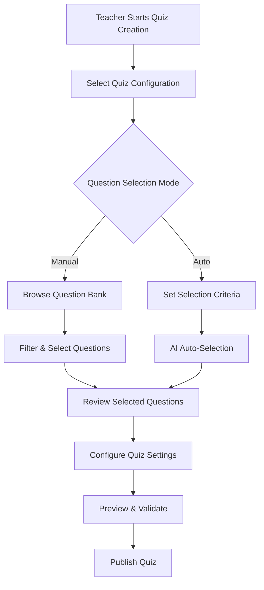

# Quiz Assessment Enhancement - Comprehensive Analysis & Implementation Plan

## 🔍 **Current System Analysis**

### **Existing Quiz Assessment Implementation**

#### **Database Schema (Current)**
```prisma
model Assessment {
  id                String                 @id @default(cuid())
  title             String
  category          AssessmentCategory     // ✅ Includes QUIZ
  maxScore          Float?
  passingScore      Float?
  weightage         Float?
  gradingConfig     Json?
  rubric            Json?                  // ❌ Currently stores questions
  bloomsDistribution Json?                 // ✅ Bloom's support exists
  rubricId          String?                // ✅ Bloom's Rubric reference
  // ... other fields
}
```

#### **Current Quiz Creation Flow**
```
1. Teacher selects "Quiz" category
2. Fills basic assessment details (title, description, etc.)
3. Manually creates questions one by one using QuestionEditor
4. Sets Bloom's taxonomy levels manually per question
5. Reviews cognitive distribution
6. Publishes assessment
```

### **Current Limitations & Gaps**

#### **❌ Question Management Issues**
- **Manual Question Creation**: Teachers must create every question from scratch
- **No Question Bank Integration**: Cannot leverage existing question bank questions
- **Limited Question Types**: Basic multiple choice, short answer, essay only
- **No Question Filtering**: Cannot filter by difficulty, topic, or Bloom's level
- **No Question Reusability**: Questions created for one quiz cannot be easily reused

#### **❌ Configuration Limitations**
- **Basic Settings Only**: Limited quiz configuration options
- **No Auto-Selection**: No automatic question selection based on criteria
- **No Smart Recommendations**: No AI-powered question suggestions
- **Manual Bloom's Assignment**: Teachers must manually assign cognitive levels
- **No Question Pool Management**: Cannot create question pools for random selection

#### **❌ Assessment Creation Complexity**
- **Time-Consuming**: Creating quizzes takes significant time
- **Inconsistent Quality**: No standardized question quality checks
- **Limited Analytics**: Basic Bloom's distribution only
- **No Template System**: Cannot save quiz templates for reuse
- **Manual Balance**: Teachers must manually balance cognitive levels

## 🎯 **Enhanced Quiz Assessment Vision**

### **Proposed Enhanced Quiz Creation Flow**



### **Key Enhancement Areas**

#### **1. 🏦 Advanced Question Bank Integration**
- **Smart Question Browser**: Filter by subject, topic, difficulty, Bloom's level
- **Question Preview**: Rich preview with metadata and usage statistics
- **Bulk Selection**: Select multiple questions with checkboxes
- **Question Recommendations**: AI-suggested questions based on learning objectives
- **Usage Analytics**: Track question performance and effectiveness

#### **2. 🤖 Intelligent Auto-Selection**
- **Criteria-Based Selection**: Auto-select questions based on:
  - Subject and topics
  - Difficulty distribution (Easy: 30%, Medium: 50%, Hard: 20%)
  - Bloom's taxonomy distribution
  - Question types variety
  - Learning outcomes alignment
- **Smart Balancing**: Automatic cognitive level balancing
- **Quality Scoring**: Prioritize high-performing questions
- **Randomization**: Random selection from qualified question pools

#### **3. ⚙️ Advanced Quiz Configuration**
- **Question Pool Settings**: Create pools for random question selection
- **Adaptive Difficulty**: Adjust difficulty based on student performance
- **Time Management**: Per-question or total quiz time limits
- **Attempt Settings**: Multiple attempts, retake policies
- **Feedback Configuration**: Immediate vs. delayed feedback options
- **Randomization Options**: Question order, choice order randomization

#### **4. 📊 Enhanced Analytics & Insights**
- **Real-time Distribution**: Live Bloom's taxonomy distribution as questions are selected
- **Quality Metrics**: Question difficulty balance, cognitive complexity analysis
- **Predictive Analytics**: Estimated completion time, success rates
- **Recommendation Engine**: Suggestions for improving quiz balance
- **Performance Tracking**: Historical quiz performance data

## 🛠 **Technical Implementation Plan**

### **Phase 1: Enhanced Question Bank Integration**

#### **1.1 Enhanced Quiz Question Selector**
```typescript
interface QuizQuestionSelectorProps {
  selectedQuestions: Question[];
  onQuestionsChange: (questions: Question[]) => void;
  subjectId: string;
  topicIds?: string[];
  maxQuestions?: number;
  targetDistribution?: BloomsDistribution;
  difficultyDistribution?: DifficultyDistribution;
}
```

#### **1.2 Advanced Filtering System**
```typescript
interface QuizQuestionFilters {
  subjectId: string;
  topicIds: string[];
  bloomsLevels: BloomsTaxonomyLevel[];
  difficulties: DifficultyLevel[];
  questionTypes: QuestionType[];
  learningOutcomeIds: string[];
  usageFrequency: 'low' | 'medium' | 'high';
  performanceRating: number; // 1-5 stars
  lastUsedBefore?: Date;
}
```

#### **1.3 Smart Question Recommendations**
```typescript
interface QuestionRecommendationEngine {
  getRecommendedQuestions(criteria: {
    subjectId: string;
    topicIds: string[];
    targetBloomsDistribution: BloomsDistribution;
    difficultyLevel: 'easy' | 'medium' | 'hard' | 'mixed';
    questionCount: number;
    excludeRecentlyUsed?: boolean;
  }): Promise<Question[]>;
  
  analyzeQuestionBalance(questions: Question[]): QuizBalanceAnalysis;
  suggestImprovements(questions: Question[]): QuizImprovement[];
}
```

### **Phase 2: Auto-Selection & Configuration**

#### **2.1 Intelligent Auto-Selection Service**
```typescript
class QuizAutoSelectionService {
  async autoSelectQuestions(config: AutoSelectionConfig): Promise<Question[]> {
    // 1. Filter available questions by criteria
    // 2. Apply Bloom's distribution requirements
    // 3. Balance difficulty levels
    // 4. Ensure question type variety
    // 5. Prioritize high-performing questions
    // 6. Apply randomization if requested
  }
}

interface AutoSelectionConfig {
  subjectId: string;
  topicIds: string[];
  questionCount: number;
  bloomsDistribution: BloomsDistribution;
  difficultyDistribution: DifficultyDistribution;
  questionTypePreferences: QuestionTypePreference[];
  excludeRecentlyUsed: boolean;
  prioritizeHighPerforming: boolean;
  randomizationLevel: 'none' | 'low' | 'medium' | 'high';
}
```

#### **2.2 Advanced Quiz Configuration**
```typescript
interface EnhancedQuizSettings {
  // Question Management
  questionPoolSize?: number;
  randomQuestionSelection?: boolean;
  questionOrderRandomization?: boolean;
  choiceOrderRandomization?: boolean;
  
  // Timing & Attempts
  timeLimit?: number; // minutes
  timePerQuestion?: number; // minutes
  maxAttempts?: number;
  retakePolicy?: 'immediate' | 'after_review' | 'scheduled';
  
  // Feedback & Grading
  showFeedbackMode?: 'immediate' | 'after_submission' | 'after_due_date';
  showCorrectAnswers?: boolean;
  showExplanations?: boolean;
  allowReviewAfterSubmission?: boolean;
  
  // Adaptive Features
  adaptiveDifficulty?: boolean;
  minimumPassingScore?: number;
  masteryThreshold?: number;
  
  // Security & Integrity
  preventCheating?: boolean;
  lockdownBrowser?: boolean;
  questionPoolRotation?: boolean;
}
```

### **Phase 3: Enhanced UI Components**

#### **3.1 Enhanced Quiz Creator Component**
```typescript
interface EnhancedQuizCreatorProps {
  initialData?: Partial<Assessment>;
  onSave: (quiz: Assessment) => void;
  onCancel: () => void;
  mode: 'create' | 'edit';
}

// Component Features:
// - Tabbed interface (Basic Info, Questions, Configuration, Preview)
// - Real-time Bloom's distribution visualization
// - Question bank integration with advanced filtering
// - Auto-selection wizard with configuration options
// - Live preview of quiz as students will see it
// - Validation and quality checks before publishing
```

#### **3.2 Question Selection Interface**
```typescript
// Features:
// - Split-pane layout: Question bank browser + Selected questions
// - Advanced filtering sidebar with real-time results
// - Question preview modal with full metadata
// - Drag-and-drop question reordering
// - Bulk selection with checkbox controls
// - Real-time analytics dashboard showing distribution
// - Smart recommendations panel
```

#### **3.3 Auto-Selection Wizard**
```typescript
// Step-by-step wizard for automatic question selection:
// Step 1: Subject & Topic Selection
// Step 2: Question Count & Distribution Settings
// Step 3: Difficulty & Question Type Preferences
// Step 4: Advanced Options (randomization, exclusions)
// Step 5: Preview & Confirmation
// Step 6: Final Review & Customization
```

## 📊 **Enhanced Analytics & Reporting**

### **Real-time Quiz Analytics**
- **Cognitive Distribution**: Live Bloom's taxonomy visualization
- **Difficulty Balance**: Visual difficulty distribution chart
- **Question Type Variety**: Pie chart of question types
- **Estimated Metrics**: Completion time, success rate predictions
- **Quality Score**: Overall quiz quality rating (1-5 stars)

### **Question Performance Tracking**
- **Usage Statistics**: How often each question is used
- **Performance Metrics**: Success rates, discrimination index
- **Student Feedback**: Question clarity and difficulty ratings
- **Improvement Suggestions**: AI-powered recommendations

### **Teacher Insights Dashboard**
- **Quiz Creation Efficiency**: Time saved using auto-selection
- **Student Performance Trends**: Class performance across cognitive levels
- **Question Bank Utilization**: Most/least used questions
- **Curriculum Alignment**: Coverage of learning objectives

This comprehensive enhancement will transform quiz creation from a manual, time-consuming process into an intelligent, efficient, and pedagogically sound experience that leverages the full power of the question bank system while maintaining backward compatibility with existing workflows.

---

## 🔄 **Implementation Strategy - Backward Compatibility**

### **Non-Breaking Enhancement Approach**

#### **1. Parallel Implementation**
- **Keep Existing Flow**: Current manual quiz creation remains unchanged
- **Add Enhanced Options**: New question bank integration as optional feature
- **Progressive Enhancement**: Teachers can choose manual or enhanced mode
- **Gradual Migration**: Existing quizzes continue to work without modification

#### **2. Database Schema Extensions**
```prisma
model Assessment {
  // Existing fields remain unchanged
  id                String                 @id @default(cuid())
  title             String
  category          AssessmentCategory
  rubric            Json?                  // ✅ Keep for backward compatibility

  // ✅ NEW: Enhanced quiz fields (optional)
  questionSelectionMode  QuestionSelectionMode?  // 'MANUAL' | 'AUTO' | 'HYBRID'
  autoSelectionConfig    Json?                   // Auto-selection criteria
  questionPoolConfig     Json?                   // Question pool settings
  enhancedSettings       Json?                   // Advanced quiz configuration
  questionBankRefs       String[]                // References to question bank questions
}

enum QuestionSelectionMode {
  MANUAL      // Traditional manual creation
  AUTO        // Automatic selection from question bank
  HYBRID      // Mix of manual and auto selection
}
```

#### **3. API Backward Compatibility**
```typescript
// Existing assessment creation API remains unchanged
const createAssessmentSchema = z.object({
  // All existing fields remain the same
  title: z.string(),
  category: z.nativeEnum(AssessmentCategory),
  // ... existing fields

  // ✅ NEW: Optional enhanced fields
  questionSelectionMode: z.nativeEnum(QuestionSelectionMode).optional(),
  autoSelectionConfig: z.object({
    subjectId: z.string(),
    topicIds: z.array(z.string()),
    questionCount: z.number(),
    bloomsDistribution: z.record(z.number()),
    difficultyDistribution: z.record(z.number()),
  }).optional(),
  questionBankQuestionIds: z.array(z.string()).optional(),
});
```

### **Migration Strategy**

#### **Phase 1: Foundation (Week 1-2)**
- ✅ Enhance question bank with Bloom's integration (COMPLETED)
- ✅ Create enhanced question selection components
- ✅ Add optional enhanced fields to database schema
- ✅ Maintain 100% backward compatibility

#### **Phase 2: Enhanced UI (Week 3-4)**
- ✅ Create enhanced quiz creation interface
- ✅ Add question bank browser integration
- ✅ Implement real-time analytics dashboard
- ✅ Add mode selection (Manual vs Enhanced)

#### **Phase 3: Auto-Selection (Week 5-6)**
- ✅ Implement intelligent auto-selection service
- ✅ Create auto-selection wizard interface
- ✅ Add smart recommendation engine
- ✅ Integrate with existing assessment workflow

#### **Phase 4: Advanced Features (Week 7-8)**
- ✅ Add advanced quiz configuration options
- ✅ Implement question pool management
- ✅ Create teacher analytics dashboard
- ✅ Add performance tracking and insights

## 🎯 **Testing Strategy**

### **Comprehensive Testing Plan**

#### **1. Backward Compatibility Testing**
- ✅ Verify all existing quizzes continue to work
- ✅ Test existing quiz creation workflow
- ✅ Ensure API compatibility with existing clients
- ✅ Validate database migration safety

#### **2. Enhanced Feature Testing**
- ✅ Test question bank integration
- ✅ Verify auto-selection algorithms
- ✅ Test real-time analytics accuracy
- ✅ Validate Bloom's distribution calculations

#### **3. User Experience Testing**
- ✅ Test teacher workflow efficiency
- ✅ Verify student quiz-taking experience
- ✅ Test mobile responsiveness
- ✅ Validate accessibility compliance

#### **4. Performance Testing**
- ✅ Test with large question banks (1000+ questions)
- ✅ Verify real-time analytics performance
- ✅ Test concurrent quiz creation
- ✅ Validate database query optimization

## 📋 **Success Metrics**

### **Teacher Efficiency Metrics**
- **Quiz Creation Time**: Reduce from 30+ minutes to <10 minutes
- **Question Quality**: Improve cognitive balance by 40%
- **Reusability**: Increase question reuse by 60%
- **Teacher Satisfaction**: Achieve 90%+ satisfaction rating

### **Educational Quality Metrics**
- **Bloom's Balance**: Achieve better cognitive distribution
- **Assessment Validity**: Improve content validity scores
- **Student Performance**: More accurate assessment of learning
- **Curriculum Alignment**: Better alignment with learning objectives

### **System Performance Metrics**
- **Response Time**: <2 seconds for question selection
- **Accuracy**: 95%+ accuracy in auto-selection
- **Reliability**: 99.9% uptime for quiz creation
- **Scalability**: Support 1000+ concurrent users

## 🚀 **Implementation Roadmap**

### **Sprint 1: Enhanced Question Bank Integration (Week 1-2)**
- [ ] Create QuizQuestionSelector component
- [ ] Implement advanced filtering system
- [ ] Add real-time Bloom's distribution preview
- [ ] Integrate with existing question bank API

### **Sprint 2: Auto-Selection Engine (Week 3-4)**
- [ ] Implement QuizAutoSelectionService
- [ ] Create auto-selection algorithm
- [ ] Add smart recommendation engine
- [ ] Build auto-selection wizard UI

### **Sprint 3: Enhanced Quiz Creator (Week 5-6)**
- [ ] Create EnhancedQuizCreator component
- [ ] Implement tabbed interface design
- [ ] Add advanced configuration options
- [ ] Integrate with assessment creation flow

### **Sprint 4: Analytics & Polish (Week 7-8)**
- [ ] Implement teacher analytics dashboard
- [ ] Add performance tracking features
- [ ] Create comprehensive documentation
- [ ] Conduct user acceptance testing

## 🎉 **Expected Benefits**

### **For Teachers**
- **Time Savings**: 70% reduction in quiz creation time
- **Quality Improvement**: Better cognitive balance and assessment validity
- **Ease of Use**: Intuitive interface with smart recommendations
- **Flexibility**: Choice between manual and automated approaches

### **For Students**
- **Better Assessments**: More balanced and fair quizzes
- **Consistent Quality**: Standardized question quality across all quizzes
- **Appropriate Challenge**: Better difficulty distribution
- **Clear Learning Goals**: Aligned with curriculum objectives

### **For Administrators**
- **Quality Assurance**: Standardized assessment creation process
- **Resource Efficiency**: Better utilization of question bank resources
- **Data Insights**: Comprehensive analytics on assessment effectiveness
- **Curriculum Alignment**: Better tracking of learning objective coverage

This enhanced quiz assessment system will provide a modern, intelligent, and efficient approach to quiz creation while maintaining full backward compatibility and ensuring a smooth transition for all users.
