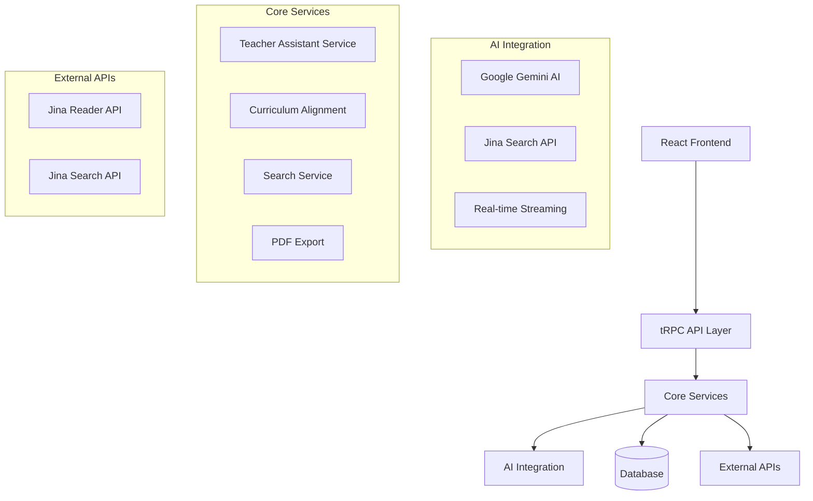

# Teacher Assistant Architecture & Implementation Guide

## 🎯 Overview

The **Teacher Assistant** is a comprehensive AI-powered educational authoring platform that revolutionizes how educators create, manage, and deliver curriculum-aligned content. Built with cutting-edge technology and pedagogical best practices, it serves as an intelligent companion for teachers worldwide.

## 🏗️ System Architecture

### High-Level Architecture



### Technology Stack

**Frontend:**
- **React 18** with TypeScript for type-safe development
- **Next.js 14** for server-side rendering and API routes
- **Tailwind CSS** for responsive, utility-first styling
- **Lucide React** for consistent iconography
- **React Markdown** for rich text rendering

**Backend:**
- **tRPC** for end-to-end type-safe API communication
- **Prisma ORM** for database management
- **PostgreSQL** for robust data storage
- **Node.js** runtime environment

**AI & Search:**
- **Google Gemini AI** for intelligent content generation
- **Jina AI Search** for educational content discovery
- **Real-time streaming** for responsive user experience

**Additional Libraries:**
- **html2canvas + jsPDF** for PDF export functionality
- **Zod** for runtime type validation
- **React Hook Form** for form management

## 🎨 Component Architecture

### Core Components Hierarchy

```
TeacherAssistantComponents/
├── TeacherAssistantButton          # Entry point trigger
├── TeacherAssistantDialog          # Main chat interface
├── TeacherAssistantCanvasMode      # Full-screen authoring
├── CurriculumAlignmentPanel        # Learning outcomes display
├── SearchInterface                 # Multi-modal search
├── SettingsPanel                   # User preferences
├── MessageList                     # Chat history
├── MessageInput                    # Message composition
├── ChatMessage                     # Individual messages
├── CopyMenu                        # Enhanced copy options
└── NotificationBadge              # Status indicators
```

### State Management

**Context-Based Architecture:**
- `TeacherAssistantProvider` - Global state management
- `useTeacherAssistant` - Custom hook for component access
- Real-time state synchronization across components

**Key State Objects:**
```typescript
interface TeacherAssistantContextValue {
  // Chat functionality
  messages: Message[];
  isTyping: boolean;
  sendMessage: (content: string) => Promise<void>;
  
  // Search capabilities
  isSearchMode: boolean;
  searchResults: SearchResult[];
  executeSearch: (query: string, filters?: SearchFilters) => Promise<void>;
  
  // Canvas mode
  isCanvasMode: boolean;
  currentDocument: Document | null;
  selectedTemplate: DocumentTemplate | null;
  
  // Curriculum alignment
  context: TeacherContext;
  assessmentCriteria: AssessmentCriteria[];
}
```

## 🧠 AI Integration & Streaming

### Gemini AI Integration

**Real-time Streaming Implementation:**
```typescript
// Streaming endpoint using tRPC
export const streamResponse = publicProcedure
  .input(streamingInputSchema)
  .subscription(async function* ({ input }) {
    const stream = await geminiService.streamGenerate(input.message);
    
    for await (const chunk of stream) {
      yield {
        type: 'content',
        content: chunk.text,
        messageId: input.messageId
      };
    }
    
    yield { type: 'complete', messageId: input.messageId };
  });
```

**Curriculum-Aligned Prompts:**
- Dynamic prompt enhancement with learning outcomes
- Bloom's taxonomy integration
- Grade-level appropriate content generation
- Assessment criteria alignment

### Jina AI Search Integration

**Multi-Modal Search Capabilities:**
```typescript
interface JinaSearchOptions {
  query: string;
  modality: 'text' | 'image' | 'video' | 'multimodal';
  filters: {
    contentType?: string;
    subject?: string;
    gradeLevel?: string;
    safeSearch: boolean;
  };
}
```

**Educational Content Filtering:**
- Safe search enforcement
- Educational appropriateness validation
- Curriculum relevance scoring
- Multi-language support

## 📚 Curriculum Alignment System

### Learning Outcomes Integration

**Database Schema Integration:**
```sql
-- Learning outcomes with Bloom's taxonomy
CREATE TABLE learning_outcomes (
  id UUID PRIMARY KEY,
  statement TEXT NOT NULL,
  blooms_level VARCHAR(20),
  action_verbs TEXT[],
  subject_id UUID REFERENCES subjects(id)
);

-- Subject topics with keywords
CREATE TABLE subject_topics (
  id UUID PRIMARY KEY,
  title VARCHAR(255),
  keywords TEXT[],
  learning_outcomes_text TEXT
);
```

**Curriculum Context Service:**
```typescript
class CurriculumAlignmentService {
  async getCurriculumContext(classId: string): Promise<CurriculumContext> {
    // Fetch learning outcomes, topics, and assessment criteria
    // Generate curriculum-aligned prompts
    // Validate content alignment
  }
}
```

### Bloom's Taxonomy Implementation

**Taxonomy Levels with Color Coding:**
- **Remember** (Blue) - Recall facts and basic concepts
- **Understand** (Green) - Explain ideas or concepts
- **Apply** (Yellow) - Use information in new situations
- **Analyze** (Orange) - Draw connections among ideas
- **Evaluate** (Red) - Justify a stand or decision
- **Create** (Purple) - Produce new or original work

## 🎨 Canvas Mode & Document Authoring

### Full-Screen Authoring Environment

**Document Templates:**
```typescript
interface DocumentTemplate {
  id: string;
  name: string;
  type: 'worksheet' | 'lesson-plan' | 'assessment' | 'handout';
  sections: DocumentSection[];
  metadata: {
    estimatedTime: number;
    gradeLevel?: string;
    subject?: string;
  };
}
```

**Rich Text Editing:**
- Markdown support with live preview
- Section-based document structure
- Progress tracking and completion indicators
- Auto-save functionality

### PDF Export System

**Professional Document Export:**
```typescript
export async function exportDocumentToPDF(
  document: Document,
  options: PDFExportOptions
): Promise<void> {
  // HTML to Canvas conversion
  // Multi-page PDF generation
  // Professional formatting
  // Metadata inclusion
}
```

## 🔍 Search & Discovery

### Multi-Modal Search Interface

**Search Modalities:**
- **Text Search** - Educational articles, lesson plans, worksheets
- **Image Search** - Visual aids, diagrams, educational graphics
- **Video Search** - Educational videos and tutorials
- **Multimodal** - Combined search across all content types

**Enhanced Search Features:**
- Real-time search suggestions
- Curriculum-aligned filtering
- Relevance scoring with visual indicators
- Safe search with educational appropriateness

### Search Result Enhancement

**Visual Search Cards:**
```typescript
interface SearchResult {
  id: string;
  title: string;
  snippet: string;
  url: string;
  source: string;
  relevanceScore: number;
  imageUrl?: string;
  contentType: 'text' | 'image' | 'video' | 'multimodal';
  metadata: {
    educationalLevel?: string;
    subject?: string;
    bloomsLevel?: string;
  };
}
```

## ⚙️ Settings & Personalization

### Comprehensive Settings System

**Setting Categories:**
- **General** - Response length, tone, language
- **Appearance** - Theme, compact mode, timestamps
- **Notifications** - Browser alerts, sounds, email digest
- **Search** - Default modality, safe search, image inclusion
- **Voice** - Text-to-speech, speed, gender selection
- **Advanced** - Streaming, curriculum alignment, auto-suggestions

**Personalization Features:**
- Teacher preference learning
- Context-aware suggestions
- Adaptive response formatting
- Cross-device synchronization

## 🚀 Performance & Optimization

### Real-Time Performance

**Streaming Optimizations:**
- Token-by-token response delivery
- Graceful fallback to non-streaming
- Connection resilience
- Memory-efficient processing

**Search Performance:**
- Debounced search queries
- Result caching
- Progressive loading
- Optimistic UI updates

### Scalability Considerations

**Architecture Scalability:**
- Stateless service design
- Database connection pooling
- API rate limiting
- Caching strategies

## 🔒 Security & Privacy

### Data Protection

**Privacy Measures:**
- Conversation encryption
- Secure API communication
- User consent management
- Data retention policies

**Educational Safety:**
- Content appropriateness filtering
- Safe search enforcement
- Age-appropriate responses
- Curriculum compliance validation

## 📊 Analytics & Insights

### Usage Analytics

**Tracked Metrics:**
- Message interactions and response times
- Search queries and result engagement
- Document creation and export patterns
- Feature adoption and usage frequency

**Educational Insights:**
- Curriculum alignment effectiveness
- Learning outcome coverage
- Content creation patterns
- Teacher productivity metrics

## 🔧 Development & Deployment

### Development Workflow

**Code Quality:**
- TypeScript for type safety
- ESLint and Prettier for code consistency
- Comprehensive error handling
- Unit and integration testing

**API Development:**
- tRPC for type-safe APIs
- Zod for runtime validation
- Streaming support with subscriptions
- RESTful fallback endpoints

### Deployment Architecture

**Production Setup:**
- Next.js deployment on Vercel/AWS
- PostgreSQL database with connection pooling
- Redis for caching and session management
- CDN for static asset delivery

## 🎯 Key Features Summary

### ✅ Implemented Features

1. **Real-Time AI Chat** - Streaming responses with Gemini AI
2. **Multi-Modal Search** - Text, image, and video search with Jina AI
3. **Curriculum Alignment** - Learning outcomes and Bloom's taxonomy integration
4. **Canvas Mode** - Full-screen document authoring environment
5. **PDF Export** - Professional document export with formatting
6. **Template System** - Pre-built templates for common educational documents
7. **Enhanced Copy Menu** - Multiple format export options
8. **Settings Panel** - Comprehensive personalization options
9. **Progress Tracking** - Document completion and curriculum coverage
10. **Educational Safety** - Content filtering and appropriateness validation

### 🎨 UI/UX Excellence

- **Modern Design** - Clean, intuitive interface with smooth animations
- **Responsive Layout** - Optimized for desktop, tablet, and mobile
- **Accessibility** - WCAG compliant with keyboard navigation
- **Visual Feedback** - Loading states, progress indicators, and success messages
- **Contextual Help** - Inline guidance and tooltips

## 🌟 Innovation Highlights

### Pedagogical Innovation
- **Curriculum-Aligned AI** - First AI assistant specifically designed for educational standards
- **Bloom's Taxonomy Integration** - Automatic content classification and generation
- **Multi-Modal Learning** - Support for diverse learning styles and preferences

### Technical Innovation
- **Real-Time Streaming** - Immediate response delivery for enhanced user experience
- **Type-Safe Architecture** - End-to-end type safety from frontend to database
- **Intelligent Search** - AI-powered educational content discovery

### User Experience Innovation
- **Canvas Mode** - Seamless transition between chat and authoring
- **Progressive Enhancement** - Graceful degradation and fallback mechanisms
- **Contextual Intelligence** - Adaptive responses based on teaching context

---

*This architecture represents a comprehensive, production-ready AI teaching assistant that combines cutting-edge technology with pedagogical best practices to empower educators worldwide.*
