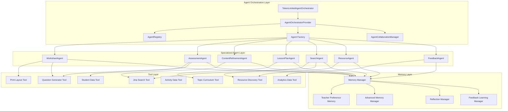
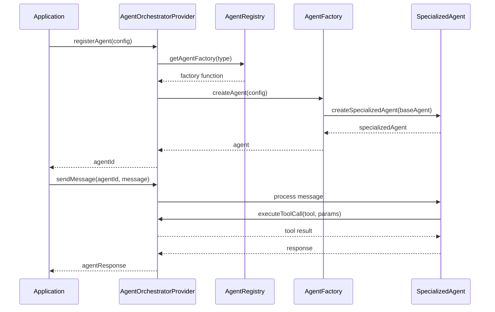
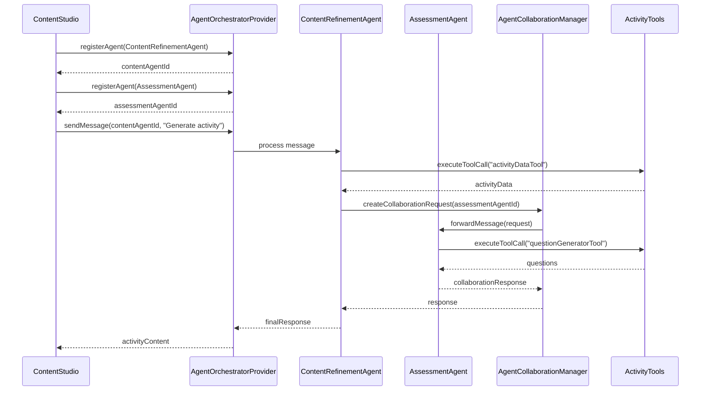
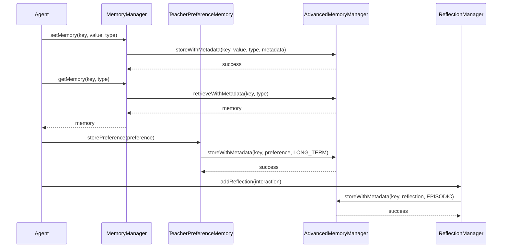
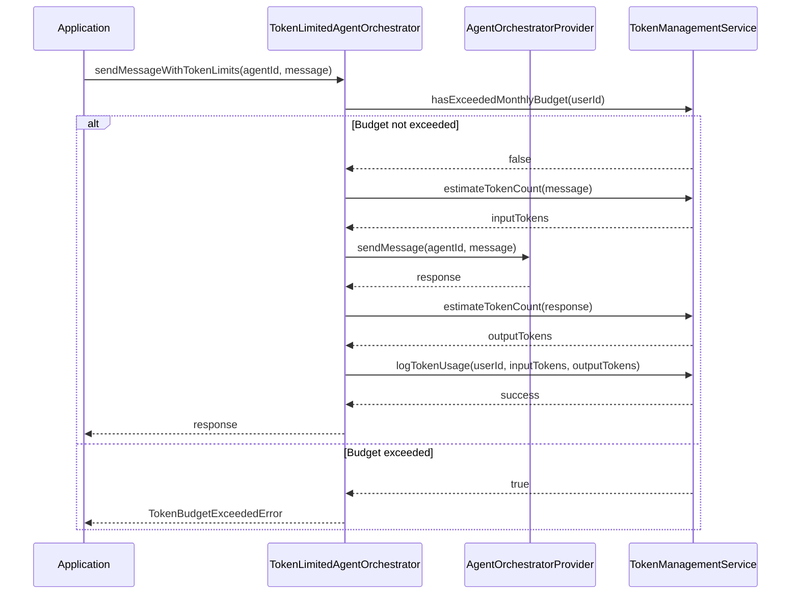
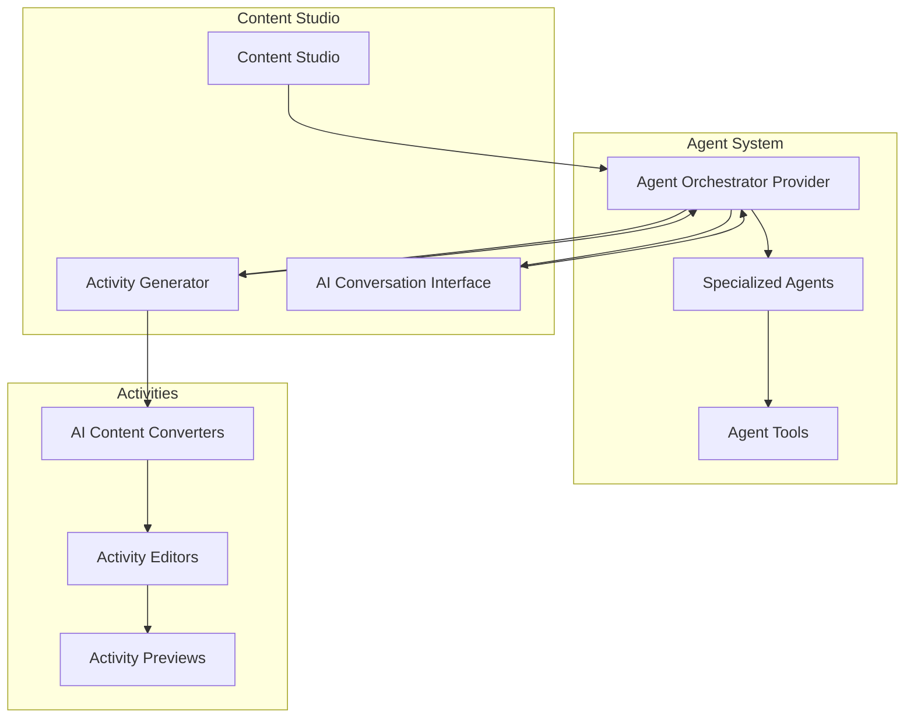
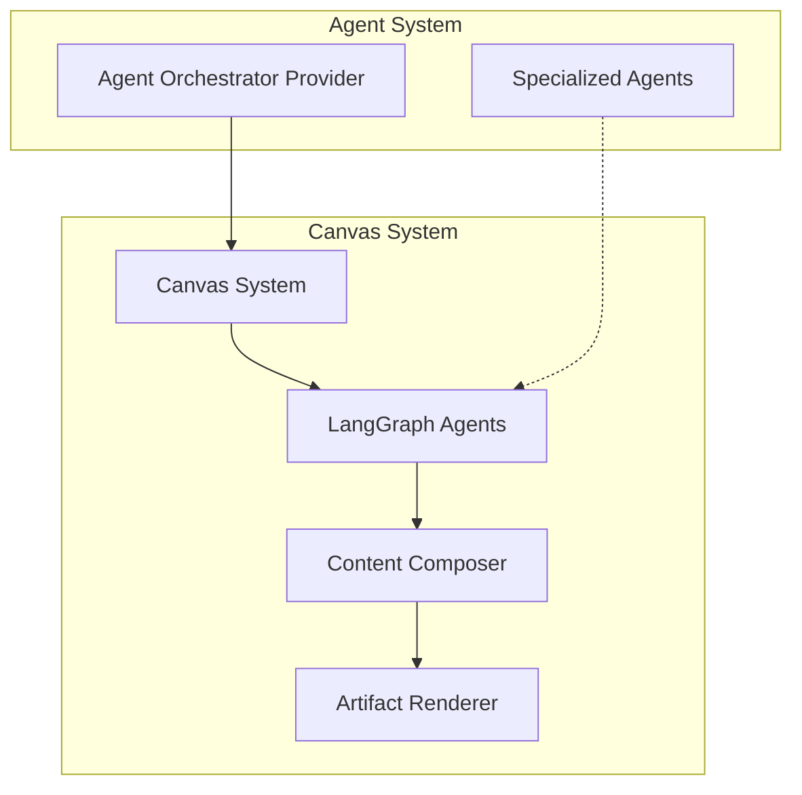
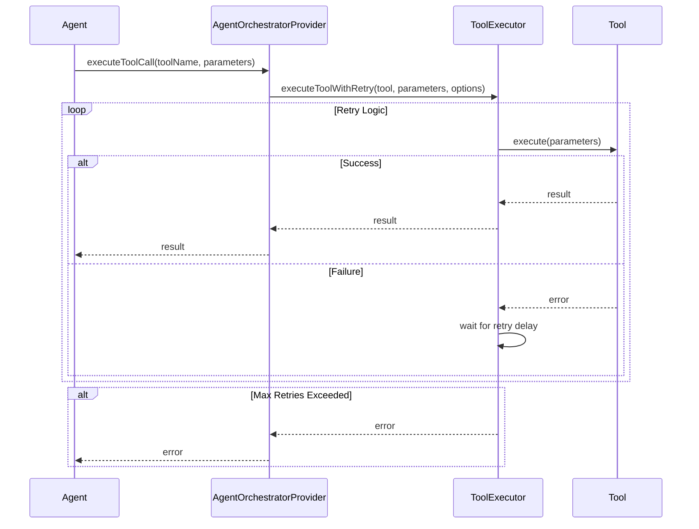
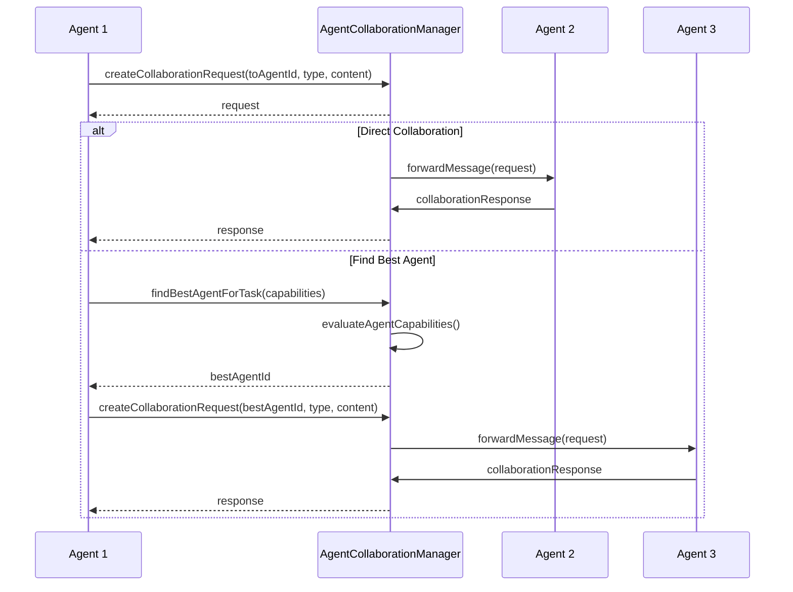

# Multi-Agent Orchestration System Diagrams

This document provides detailed diagrams of the Multi-Agent Orchestration system architecture and workflows.

## System Architecture

## Agent Registration and Communication Flow

## Content Generation Workflow

## Memory Management Flow

## Token Management Flow

## Integration with Activities and Content Studio

## Canvas Integration

## Tool Execution Flow

## Agent Collaboration Flow

